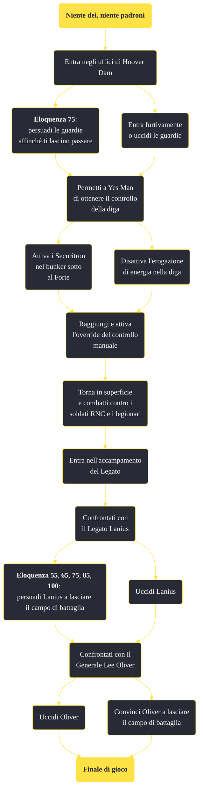

---
# Title, summary, and page position.
linktitle: "Niente dei, niente padroni"
summary: ""
weight: 10
icon: message-question
icon_pack: fas

# Page metadata.
title: "Niente dei, niente padroni"
date: 2022-11-15
type: book # Do not modify.
commentable: true
tags: "Missioni principali di Fallout: New Vegas"
hidden: true # Visibile nella sidebar
private: false # Nascosto dalle ricerche
---

*Niente dei, niente padroni* è una missione principale di Fallout: New Vegas. È data da Yes Man al Lucky 38.

<section class="chart-collapse">
<input type="checkbox" name="collapse2" id="handle2">
<h3 class="handle">
<label for="handle2">Clicca per mostrare il diagramma</label>
</h3>

</section>

| Tappe |       Stato        | Descrizione |
|:-----:|:------------------:| ----------- |
|                           10                          |            | Vai nella sala di controllo di Hoover Dam e installa il chip comandi manuali.                                                                                               |
|                           20                          |            | Attiva la centrale elettrica orientale per alimentare l'esercito di Securitron.                                                                                             |
|                           25                          |            | Distruggi i generatori della diga.                                                                                                                                          |
|                           30                          |            | Esci dal lato orientale della diga.                                                                                                                                         |
|                           40                          |            | Dirigiti all'accampamento del Legato e occupati del Legato e della Legione di Caesar.                                                                                       |
|                           50                          |            | Occupati del Generale Oliver e dell'RNC.                                                                                                                                    |
|                           90                          | :white_check_mark: | Torna da Yes Man con le notizie della tua vittoria.                                                                                                                         |

**Sfide abilità**:
- **Eloquenza 75**: per persuadere i due soldati armati di inceneritori
- **Eloquenza 55**, **65**, **75**, **85**, **100**: parlando con Lanius nel dialogo finale
- **Baratto 100**: parlando con Lanius (rendendolo ostile)

