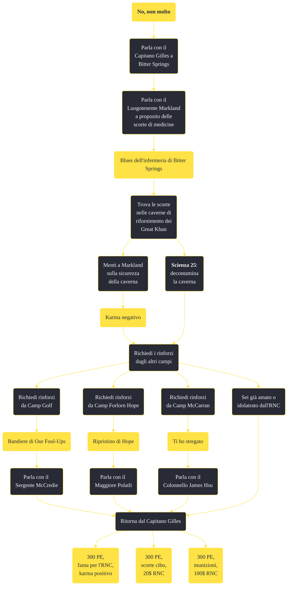

---
# Title, summary, and page position.
linktitle: "No, non molto"
summary: ""
weight: 10
icon: message-question
icon_pack: fas

# Page metadata.
title: "No, non molto"
date: 2022-11-15
type: book # Do not modify.
commentable: true
tags: "Missioni secondarie di Fallout: New Vegas"
hidden: true # Visibile nella sidebar
private: false # Nascosto dalle ricerche
---

*No, non molto* è una missione secondaria di Fallout: New Vegas. È data dal Capitano Gilles a Bitter Springs.

<section class="chart-collapse">
<input type="checkbox" name="collapse2" id="handle2">
<h3 class="handle">
<label for="handle2">Clicca per mostrare il diagramma</label>
</h3>

</section>

| Tappe |       Stato        | Descrizione |
|:-----:|:------------------:| ----------- |
|                           30                          |            | Parla al Luogotenente Markland del reperimento di scorte di medicinali per l'accampamento.                                                                                  |
|                           20                          |            | Parla a Camp Golf dello spostamento di soldati a Bitter Springs.                                                                                                            |
|                           24                          |            | Parla a Camp Forlorn Hope dello spostamento di soldati a Bitter Springs.                                                                                                    |
|                           22                          |            | Parla a Camp McCarran dello spostamento di soldati a Bitter Springs.                                                                                                        |
|                           80                          | :white_check_mark: | Parla al Capitano Gilles per la tua ricompensa.                                                                                                                             |

**Sfide abilità**:
- **Scienza 25**: per decontaminare una delle caverne irradiate
- **Eloquenza 50**: per convincere Oscar Velasco a cedere la chiave di uno dei nascondigli delle scorte

**Note**:
- Mentire a Gilles prima di aver decontaminato la caverna, farà finire la missione, indipendentemente dai progressi fatti
- Dovrai chiedere rinforzi agli altri accampamenti dell'RNC, cioè Camp Golf, Camp Forlorn Hope e Camp McCarran e lo puoi fare in due modi distinti:
  - completare le missioni *Bandiere di Our Foul-Ups*, *Ti ho stregato* e *Ripristino di Hope* e poi parlare rispettivamente con il Sergente McCredie, il Colonnello James Hsu e Maggiore Polatli
  - essere idolatrato (o amato) dall'RNC e rivolgersi agli ufficiali dei vari accampamenti, chiedendo semplicemente supporto 

