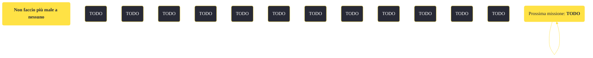

---
# Title, summary, and page position.
linktitle: "Non faccio più male a nessuno"
summary: ""
weight: 10
icon: message-question
icon_pack: fas

# Page metadata.
title: "Non faccio più male a nessuno"
date: 2022-11-15
type: book # Do not modify.
commentable: true
tags: "Missioni secondarie di Fallout: New Vegas"
hidden: true # Visibile nella sidebar
private: false # Nascosto dalle ricerche
---

*Non faccio più male a nessuno* è una missione secondaria di Fallout: New Vegas. È data dal Luogotenente Gorobets a Camp McCarran o a Camp Forlorn Hope.

<section class="chart-collapse">
<input type="checkbox" name="collapse2" id="handle2">
<h3 class="handle">
<label for="handle2">Clicca per mostrare il diagramma</label>
</h3>

</section>

| Tappe |       Stato        | Descrizione |
|:-----:|:------------------:| ----------- |
|                           10                          |            | Parla con il Caporale Betsy di come fornirle assistenza medica per superare il suo trauma.                                                                                  |
|                           20                          |            | Parla con gli altri membri del 1º Ricognitori riguardo all'aiuto da fornire a Betsy.                                                                                        |
|                           21                          |            | Parla con 10 of Spades.                                                                                                                                                     |
|                           22                          |            | Parla con il Caporale Sterling.                                                                                                                                             |
|                           23                          |            | Parla con il Sergente Bitter-Root.                                                                                                                                          |
|                           30                          |            | Comunica al Caporale Betsy che il resto della Prima ricognizione concorda sul fatto che ha bisogno di aiuto.                                                                |
|                           40                          |            | Comunica al Luogotenente Gorobets che il Caporale Betsy comincerà ad essere curata.                                                                                         |
|                           50                          | :white_check_mark: | Consegna il messaggio di Gorobets al Dottor Usanagi alla clinica medica di New Vegas.                                                                                       |

**Sfide abilità**:
- **Eloquenza 60**/**Medicina 40**: per convincere il Luogotenente Gorobets a farsi curare

