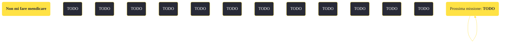

---
# Title, summary, and page position.
linktitle: "Non mi fare mendicare"
summary: ""
weight: 10
icon: message-question
icon_pack: fas

# Page metadata.
title: "Non mi fare mendicare"
date: 2022-11-15
type: book # Do not modify.
commentable: true
tags: "Missioni secondarie di Fallout: New Vegas"
hidden: true # Visibile nella sidebar
private: false # Nascosto dalle ricerche
---

*Non mi fare mendicare* è una missione secondaria di Fallout: New Vegas. È data da Melissa all'accampamento dei Great Khan.

<section class="chart-collapse">
<input type="checkbox" name="collapse2" id="handle2">
<h3 class="handle">
<label for="handle2">Clicca per mostrare il diagramma</label>
</h3>

</section>

| Tappe |       Stato        | Descrizione |
|:-----:|:------------------:| ----------- |
|                           10                          |            | Perquisisci la valigia a Sloan alla ricerca del carico di droga.                                                                                                            |
|                           20                          |            | Chiedi a Chomps Lewis informazioni sulla valigia vuota nel suo ufficio.                                                                                                     |
|                           30                          |            | Recupera il carico di droga da Tyrone a Primm.                                                                                                                              |
|                           40                          | :white_check_mark: | Torna da Melissa con il carico di droga.                                                                                                                                    |
|                           46                          | :white_check_mark: | Rivela l'operazione di contrabbando dei Great Khan al Luogotenente Hayes.                                                                                                   |

**Sfide abilità**:
- **Eloquenza 40**/**Baratto 35**/**Forza 7**/**Vedova nera**: per ottenere le droghe da Tyrone

**Note**:
- Tornare da Melissa, dopo aver informato Hayes, non farà ottenere alcuna ricompensa; se si ammette di aver spifferato tutto all'RNC, lei e gli altri Khan diventeranno ostili 

