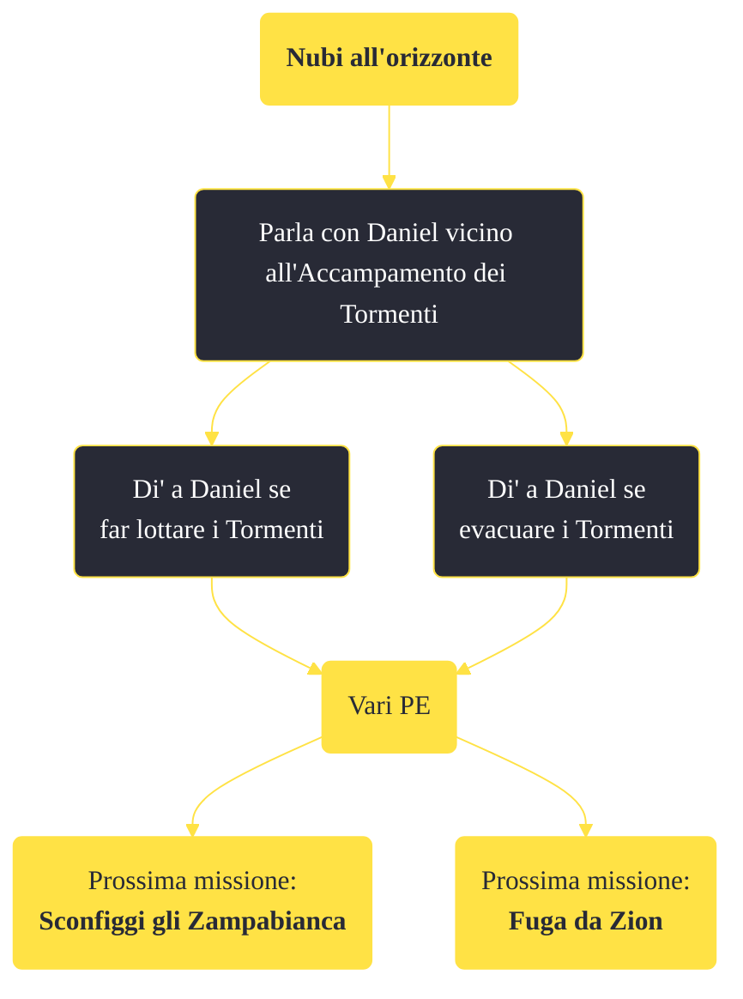

---
# Title, summary, and page position.
linktitle: "Nubi all'orizzonte"
summary: ""
weight: 10
icon: message-question
icon_pack: fas

# Page metadata.
title: "Nubi all'orizzonte"
date: 2022-11-15
type: book # Do not modify.
commentable: true
tags: "Missioni di Honest Hearts"
hidden: true # Visibile nella sidebar
private: false # Nascosto dalle ricerche
---

*Nubi all'orizzonte* è una missione del DLC *Honest Hearts* di Fallout: New Vegas. È data da Daniel all'accampamento dei Tormenti.

**Riassunto**:
1. Occupati dell'accampamento degli Zampabianca
   - Distruggi gli accampamenti al Promontorio dei bighorner
   - Ruba i totem di guerra degli Zampabianca dagli accampamenti
2. Ricompensa: **vari PE**
3. Prossima missione: *Nubi all'orizzonte*

<section class="chart-collapse">
<input type="checkbox" name="collapse2" id="handle2">
<h3 class="handle">
<label for="handle2">Clicca per mostrare il diagramma</label>
</h3>

</section>

| Tappe |       Stato        | Descrizione |
|:-----:|:------------------:| ----------- |
|                           10                          |            | Torna da Daniel nelle Gole.                                                                                                                                                 |
|                           20                          | :white_check_mark: | Di' a Daniel se i Tormenti devono combattere o fuggire.                                                                                                                     |

**Note**:
- Completando questa missione, tutti gli oggetti dati a Nuvola Nascente torneranno nel tuo inventario 

