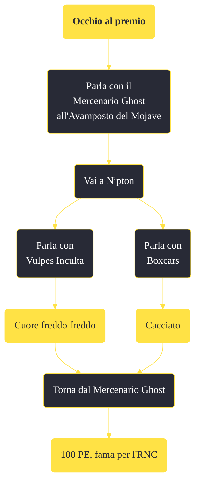

---
# Title, summary, and page position.
linktitle: "Occhio al premio"
summary: ""
weight: 10
icon: message-question
icon_pack: fas

# Page metadata.
title: "Occhio al premio"
date: 2022-11-15
type: book # Do not modify.
commentable: true
tags: "Missioni secondarie di Fallout: New Vegas"
hidden: true # Visibile nella sidebar
private: false # Nascosto dalle ricerche
---

*Occhio al premio* è una missione secondaria di Fallout: New Vegas. È data dal Mercenario Ghost all'Avamposto del Mojave.

<section class="chart-collapse">
<input type="checkbox" name="collapse2" id="handle2">
<h3 class="handle">
<label for="handle2">Clicca per mostrare il diagramma</label>
</h3>

</section>

| Tappe |       Stato        | Descrizione |
|:-----:|:------------------:| ----------- |
|                           10                          |            | Perquisisci il municipio di Nipton alla ricerca del Mercenario Ghost.                                                                                                       |
|                           20                          | :white_check_mark: | Torna dal Mercenario Ghost all'avamposto del Mojave.                                                                                                                        |

**Note**:
- Se hai come seguace Boone, Vulpes Inculta sarà ostile e sarà impossibile interagire con lui 

