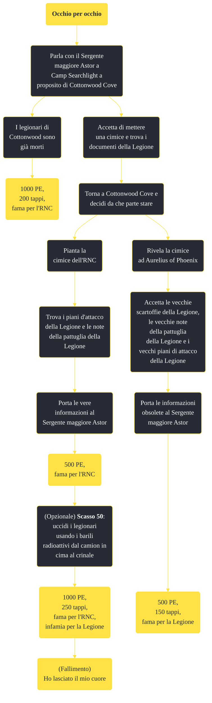

---
# Title, summary, and page position.
linktitle: "Occhio per occhio"
summary: ""
weight: 10
icon: message-question
icon_pack: fas

# Page metadata.
title: "Occhio per occhio"
date: 2022-11-15
type: book # Do not modify.
commentable: true
tags: "Missioni secondarie di Fallout: New Vegas"
hidden: true # Visibile nella sidebar
private: false # Nascosto dalle ricerche
---

*Occhio per occhio* è una missione secondaria di Fallout: New Vegas. È data dal Sergente maggiore Astor a Camp Searchlight.

<section class="chart-collapse">
<input type="checkbox" name="collapse2" id="handle2">
<h3 class="handle">
<label for="handle2">Clicca per mostrare il diagramma</label>
</h3>

</section>

| Tappe |       Stato        | Descrizione |
|:-----:|:------------------:| ----------- |
|                           10                          |            | Trova informazioni generali sullo spostamento delle truppe della Legione.                                                                                                   |
|                           20                          |            | Trova informazioni sugli attacchi della Legione.                                                                                                                            |
|                           30                          |            | Piazza la cimice dell'RNC.                                                                                                                                                  |
|                           40                          |            | Torna dal Primo Sergente Astor con le informazioni.                                                                                                                         |
|                           45                          |            | [Opzionale] Parla ad Aurelius di Phoenix dei piani dell'RNC.                                                                                                                |
|                           50                          |            | [Opzionali] Dai al Primo Sergente Astor le vecchie informazioni.                                                                                                            |
|                           75                          |            | Torna dal sergente maggiore Astor se vuoi occuparti di Cottonwood Cove.                                                                                                     |
|                           90                          |            | Uccidi tutti i Legionari a Cottonwood Cove.                                                                                                                                 |
|                           95                          |            | [Opzionale] Trova un modo per bloccare Cottonwood Cove.                                                                                                                     |
|                          100                          | :white_check_mark: | Torna dal Primo Sergente Astor.                                                                                                                                             |

**Note**:
- Indossando un'armatura della Legione e restando furtivo, il Corriere non perde reputazione quando utilizza i barili radioattivi sulla Legione; tuttavia se non ha già completato *Ho lasciato il mio cuore*, la missione fallirà, poiché oltre che ai soldati moriranno anche i Weathers, lì prigionieri 
- Questa missione fa parte delle attività che devi compiere per guadagnare la fiducia di Boone e sbloccare *Mi sono dimenticato di ricordarmi di dimenticare*; se non hai intenzione di uccidere i legionari, Boone può essere lasciato alla vicina Stazione Mercenari Echo

