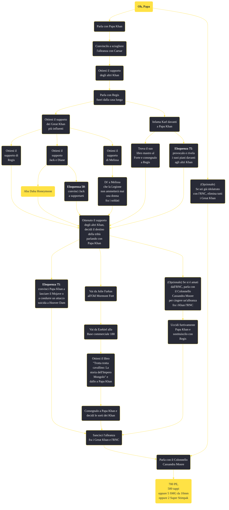

---
# Title, summary, and page position.
linktitle: "Oh, Papa"
summary: ""
weight: 10
icon: message-question
icon_pack: fas

# Page metadata.
title: "Oh, Papa"
date: 2022-11-15
type: book # Do not modify.
commentable: true
tags: "Missioni secondarie di Fallout: New Vegas"
hidden: true # Visibile nella sidebar
private: false # Nascosto dalle ricerche
---

*Oh, Papa* è una missione secondaria di Fallout: New Vegas. È data da Regis al Red Rock Canyon.

<section class="chart-collapse">
<input type="checkbox" name="collapse2" id="handle2">
<h3 class="handle">
<label for="handle2">Clicca per mostrare il diagramma</label>
</h3>

</section>

| Tappe |       Stato        | Descrizione |
|:-----:|:------------------:| ----------- |
|                           10                          |            | Parla con Papa Khan dell'alleanza con Caesar.                                                                                                                               |
|                           20                          |            | Parla con Regis di come convincere Papa Khan.                                                                                                                               |
|                           30                          |            | Convinci Jack e Diane a ribellarsi a Caesar.                                                                                                                                |
|                           32                          |            | Procura a Diane prove delle persecuzioni dei corrieri della droga da parte della Legione.                                                                                   |
|                           35                          |            | Procura a Regis prove dell'intenzione di Caesar di annientare i Great Khan.                                                                                                 |
|                           38                          |            | Riporta il libro maestro degli schiavi della Legione a Regis.                                                                                                               |
|                           40                          |            | Convinci Melissa a ribellarsi a Caesar.                                                                                                                                     |
|                           50                          |            | Convinci Regis a ribellarsi a Caesar.                                                                                                                                       |
|                           55                          |            | Parla con Papa Khan dello scioglimento dell'alleanza.                                                                                                                       |
|                           57                          |            | Parla con i Seguaci dell'Apocalisse riguardo ai Great Khan.                                                                                                                 |
|                           58                          |            | Parla con Ezekiel della storia dei Great Khan.                                                                                                                              |
|                           59                          |            | Riporta il libro di storia a Papa Khan.                                                                                                                                     |
|                           60                          |            | OPZIONALE: Trova un modo per disonorare Karl dinanzi a Papa Khan.                                                                                                           |
|                           65                          |            | Porta prove del piano di Karl a Papa Khan.                                                                                                                                  |
|                           70                          |            | Uccidi Papa Khan senza farti scoprire.                                                                                                                                      |
|                           75                          |            | Parla con Regis dell'RNC.                                                                                                                                                   |
|                           80                          | :white_check_mark: | Parla con il Colonnello Moore di un'alleanza tra i Great Khan e l'RNC.                                                                                                      |
|                           85                          |            | Torna a Red Rock Canyon e parla con Papa Khan.                                                                                                                              |
|                           90                          | :white_check_mark: | Parla con Regis della fedeltà dei Khan.                                                                                                                                     |
|                           95                          | :white_check_mark: | Elimina i Great Khan a Red Rock Canyon.                                                                                                                                     |

**Sfide abilità**:
- **Eloquenza 60**: per convincere Jack nello sciogliere l'alleanza con la Legione
- **Eloquenza 75**: per smascherare le vere intenzioni di Karl davanti ai Khan
- **Eloquenza 75**: per convincere Papa Khan a sciolgiere l'alleanza con la Legione e lasciare il Mojave"

**Note**:
- Se uccidi Papa Khan e non hai finito la missione *Perché non possiamo essere amici?*, questa fallirà istantaneamente 
- Se scegli le sfide Eloquenza per screditare Karl, può succedere che sia impossibile usare il suo diario come prova per guadagnare il supporto di Regis; in questo è necessario usare il suo libro mastro per persuadere Regis 
- Se, a fine missione, chiedi a Papa Khan di allearsi con l'RNC e poi di restare nei paraggi, la missione resterà inconclusa fintanto che non si parlerà con Regis/Moore e si avrà assassinato Papa Khan 
- Se tutti gli ufficiali comandanti a Camp Forlorn Hope sono stati uccisi in *Siamo la Legione*, Papa Khan ti informerà che, dati gli eventi, verrà eletto prossimo capo dei Khan; inoltre, uccidendo Papa Khan furtivamente nel sonno, automaticamente diventerai il nuovo leader e, informato Regis, riceverai l'approvazione e la fama degli altri Khan, completando la missione

