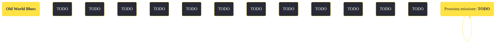

---
# Title, summary, and page position.
linktitle: "Old World Blues" 
summary: ""
weight: 10
icon: message-question
icon_pack: fas

# Page metadata.
title: "Old World Blues"
date: 2022-11-15
type: book # Do not modify.
commentable: true
tags: "Missioni di Old World Blues"
hidden: true # Visibile nella sidebar
private: false # Nascosto dalle ricerche
---

*Old World Blues* è una missione del DLC *Old World Blues* di Fallout: New Vegas. È data dal dottor Klein al Serbatoio del pensiero.

<section class="chart-collapse">
<input type="checkbox" name="collapse2" id="handle2">
<h3 class="handle">
<label for="handle2">Clicca per mostrare il diagramma</label>
</h3>

</section>

| Tappe |       Stato        | Descrizione |
|:-----:|:------------------:| ----------- |
|                           10                          |            | Torna al Serbatoio del pensiero e informa il Dr. Klein che hai completato i tuoi incarichi.                                                                                 |
|                           20                          |            | Vai alla Cupola della Zona proibita.                                                                                                                                        |
|                           25                          |            | Disattiva o distruggi il Roboscorpione gigante.                                                                                                                             |
|                           30                          |            | Affronta il Dr. Mobius alla Cupola della Zona proibita.                                                                                                                     |
|                           35                          |            | (Opzionale) Soddisfa la curiosità del Dr. Mobius su come ci si sente a essere uccisi.                                                                                       |
|                           40                          |            | Recupera il tuo cervello dalla Zona proibita.                                                                                                                               |
|                           50                          |            | Parla con Klein al Serbatoio del pensiero e metti fine al tuo imprigionamento a Big MT.                                                                                     |
|                           51                          |            | (Opzionale) Recupera l'olonastro di personalità dell'Auto-Doc del Pozzo dall'Y-17 per ripristinare la funzionalità dell'Auto-Doc.                                           |
|                           52                          |            | (Opzionale) Utilizza l'Auto-Doc del Pozzo per recuperare il tuo cuore originario.                                                                                           |
|                           53                          |            | (Opzionale) Utilizza l'Auto-Doc del Pozzo per recuperare la tua colonna vertebrale originaria.                                                                              |
|                           60                          |            | Uccidi Klein e gli altri membri del Serbatoio del pensiero.                                                                                                                 |
|                           70                          | :white_check_mark: | Lascia il Serbatoio del pensiero.                                                                                                                                           |

**Sfide abilità**:
- **Scienza 50**:  per attivare le torrette automatiche
- **Scienza 100**: per disattivare permanentemente il roboscorpione gigante X-42 (la password è in un olonastro a sinistra della piattaforma dei protectron)
- **Esperto in robotica**: per disattivare temporaneamente il roboscorpione gigante X-42
- **Riparazione 75**/**Scienza 50**/**Eloquenza 65**/**Intelligenza 7**/**Percezione 7**, **Medicina 65**, A**rmi 75**: per confrontarsi pacificamente con il Dottor Mobius e il proprio cervello
- **Uno scapolo incallito**/**Cherchez La Femme**/**Donnaiolo**/**Vedova nera**: per sbloccare alcuni dialoghi unici con il cervello
- **Eloquenza 75**: per convincere il cervello a tornare nel corpo del Corriere
- **Eloquenza 75**/**Medicina 85**/**Scienza 100**: per confrontarsi con il Serbatoio del pensiero

**Note**:
- È possibile confrontarsi pacificamente con il Serbatoio del pensiero anche senza superare le sfide abilità: sarà necessario aver completato almeno tre delle quattro missioni secondarie dei rispettivi dottori (*In fondo è solo un nome*, *Sulla stessa lunghezza d'onda*, *Il miglior amico di un cervello* e *Fuori dal guscio*)
- Se hanno già iniziato le missioni secondarie dei dottori ma si conclude il DLC violentemente, sarà impossibile completare queste missioni e non verrà riportato il loro fallimento

