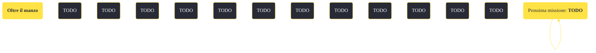

---
# Title, summary, and page position.
linktitle: "Oltre il manzo"
summary: ""
weight: 10
icon: message-question
icon_pack: fas

# Page metadata.
title: "Oltre il manzo"
date: 2022-11-15
type: book # Do not modify.
commentable: true
tags: "Missioni secondarie di Fallout: New Vegas"
hidden: true # Visibile nella sidebar
private: false # Nascosto dalle ricerche
---

*Oltre il manzo* è una missione secondaria di Fallout: New Vegas. È data dal Mortimer o da Heck Gunderson all'Ultra-Luxe.

<section class="chart-collapse">
<input type="checkbox" name="collapse2" id="handle2">
<h3 class="handle">
<label for="handle2">Clicca per mostrare il diagramma</label>
</h3>

</section>

| Tappe |       Stato        | Descrizione |
|:-----:|:------------------:| ----------- |
|                           10                          |            | Chiedi in giro all'Ultra-Luxe per raccogliere informazioni sulla scomparsa di Ted Gunderson.                                                                                |
|                           20                          |            | Chiedi informazioni a Mortimer all'Ultra-Luxe sull'investigatore.                                                                                                           |
|                           30                          |            | Intrufolati nella stanza dell'investigatore all'Ultra-Luxe.                                                                                                                 |
|                           35                          |            | Perquisisci l'investigatore alla ricerca di indizi.                                                                                                                         |
|                           40                          |            | Incontra il contatto dell'investigatore nel bagno turco dell'Ultra-Luxe alle 16.00.                                                                                         |
|                           50                          |            | Trova un modo per accedere alla Sezione solo per soci del Gourmand.                                                                                                         |
|                           60                          |            | (OPZIONALE) Trova uno sponsor che ti aiuti ad entrare a far parte della White Glove Society.                                                                                |
|                           70                          |            | (OPZIONALE) Avverti Heck Gunderson della situazione di suo figlio.                                                                                                          |
|                           75                          |            | (OPZIONALE) Sbarazzati di Philippe e cucina per il banchetto usando la sua ricetta per preparare la carne umana.                                                            |
|                           76                          |            | (OPZIONALE) Narcotizza il vino del banchetto della White Glove Society.                                                                                                     |
|                           78                          |            | (OPZIONALE) Usa l'intercom per chiamare il capo cameriere.                                                                                                                  |
|                           79                          |            | (OPZIONALE) Porta Ted alla sezione riservata ai soci per smascherare Mortimer alla fine del suo discorso durante il banchetto.                                              |
|                           80                          |            | Riporta Ted da suo padre se è ancora vivo.                                                                                                                                  |
|                           90                          | :white_check_mark: | Parla con Heck Gunderson.                                                                                                                                                   |
|                          100                          |            | Parla con Ted Gunderson: è tenuto in ostaggio in una stanza sotto il Gourmand.                                                                                              |
|                          105                          |            | Riporta Ted a suo padre al bar Top Shelp dell'Ultra-Luxe.                                                                                                                   |
|                          110                          |            | Procurati un degno sostituto di Ted Gunderson quale piatto forte della White Glove Society.                                                                                 |
|                          120                          |            | Parla con Carlyle St. Clair all'Underpass.                                                                                                                                  |
|                          125                          |            | (OPZIONALE) Chiudi uno dei tuoi compagni umani nel congelatore della cucina come sostituto per Ted.                                                                         |
|                          130                          |            | Trascina il cadavere di Carlyle fino alla discarica accanto a casa sua.                                                                                                     |
|                          150                          |            | Uccidi Ted Gunderson.                                                                                                                                                       |
|                          160                          |            | Preleva dei campioni dal cadavere di Ted per usarli per incastrare suo padre.                                                                                               |
|                          170                          |            | Spargi i tuoi campioni attorno al letto e nel lavandino di Heck Gunderson nella sua suite nell'attico dell'Ultra-Luxe.                                                      |
|                          180                          |            | Invia un Securitron dalla Strip ad indagare sulla suite di Heck Gunderson.                                                                                                  |
|                          200                          | :white_check_mark: | Torna da Mortimer nell'Ultra-Luxe.                                                                                                                                          |

**Sfide abilità**:
- **Cannibale**: farà indignare Marjorie e la White Glove Society diventerà ostile
- **Eloquenza 35**: per convincere Heck Gunderson a continuare a vendere carne di bramino all'Ultra-Luxe
- **Eloquenza 55**/**Riparazione 35**: per convincere la guardia a lasciarci entrare nel seminterrato
- **Eloquenza 55**: per spaventare Philippe e rinchiuderlo nella cella frigorifera
- **Eloquenza 55**/**Baratto 55**: per ottenere la ricetta di carne strana
- **Eloquenza 62**: durante un dialogo iniziale con Mortimer
- **Vedova Nera**/**Scapolo incallito**/**Forza 7**/**Medicina 45**/**Armi 45**/**Disarmato 45**: per tramortire Carlyle St. Clair III
- **Medicina 25**: per drogare il vino con il Med-X
- **Medicina 55**: per fingere di diagnosticare una crisi nevrotica a Philippe e ottenere la chiave della cella frigorifera
- **Sopravvivenza 75**/**Intelligenza 6**: per poter cucinare la torta di carne di imitazione

**Note**:
- Raggiunto il seminterrato, il Corriere deve vestirsi da membro della White Glove Society o essere fuori dalla vista del cameriere, altrimenti diventerà ostile.
- È possibile completare questa missione furtivamente: dopo aver parlato con Heck, il Corriere dovrà prendere la porta dietro al bar, raggiungere il Gourmand e poi la cucina, hackerare il terminale per aprire la cella frigorifera, accompagnare Ted evitando Philippe e ritornare nella hall. 
- Stranamente, aiutare la White Glove Society a tornare al cannibalismo o smascherare Mortimer, non influenzano il successo di Date a Caesar quello che è di Caesar, tranne che per una differenza di guadagno di fama per la Legione di Caesar; è una delle pochissime missioni nel gioco che non porta ripercussioni per altre fazioni o personaggi
- L'unico modo per guadagnare fama per la Strip è riportare Ted da Heck; aiutando Mortimer si guadagnerà fama per la White Glove Society, ma non per la Strip
- Dalla versione 1.4 del gioco, questa missione è disponibile solo parlando con Heck Anderson e non saranno disponibili le opzioni di dialogo riguardo il cannibalismo (parlando con Marjorie o Mortimer) finché non si parla con Heck
- Questa missione è, assieme a *Aba Daba Honeymoon*, una delle più buggate nel gioco

