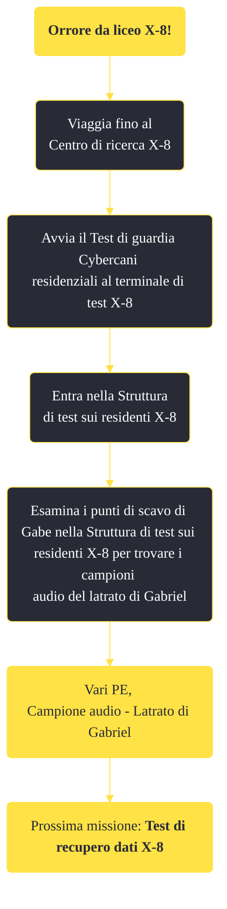

---
# Title, summary, and page position.
linktitle: "Orrore da liceo X-8!" 
summary: ""
weight: 10
icon: message-question
icon_pack: fas

# Page metadata.
title: "Orrore da liceo X-8!"
date: 2022-11-15
type: book # Do not modify.
commentable: true
tags: "Missioni di Old World Blues"
hidden: true # Visibile nella sidebar
private: false # Nascosto dalle ricerche
---

*Orrore da liceo X-8!* è una missione del DLC *Old World Blues* di Fallout: New Vegas. È data dal dottor Klein al Serbatoio del pensiero.

<section class="chart-collapse">
<input type="checkbox" name="collapse2" id="handle2">
<h3 class="handle">
<label for="handle2">Clicca per mostrare il diagramma</label>
</h3>

</section>

| Tappe |       Stato        | Descrizione |
|:-----:|:------------------:| ----------- |
|                           10                          |            | Vai al Centro di ricerca X-8.                                                                                                                                               |
|                           20                          |            | Avvia il Test istituzionale di recupero dati al terminale di test X-8.                                                                                                      |
|                           25                          |            | Recupera i registri dei tre studenti dai terminali da scrivania nella Struttura istituzionale X-8.                                                                          |
|                           30                          |            | Esci dalla Struttura istituzionale X-8.                                                                                                                                     |
|                           40                          |            | Avvia il Test di guardia Cybercani residenziali al terminale di test X-8.                                                                                                   |
|                           50                          |            | Entra nella Struttura di test sui residenti X-8.                                                                                                                            |
|                           60                          | :white_check_mark: | Esamina i punti di scavo di Gabe nella Struttura di test sui residenti X-8 per trovare i campioni audio del latrato di Gabriel.                                             |

**Note**:
- Se si uccide Gabe, il suo corpo esploderà dopo circa 10 secondi, emettendo un'onda d'urto simili a quella di una mininuke
La buca nella quale è nascosto il campione audio del latrato di Gabriel è scelta randomicamente dal gioco

