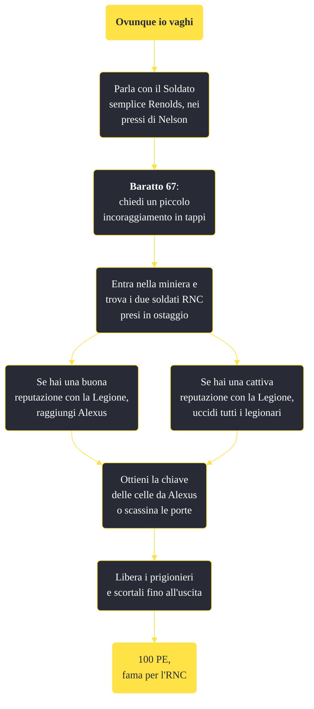

---
# Title, summary, and page position.
linktitle: "Ovunque io vaghi"
summary: ""
weight: 10
icon: message-question
icon_pack: fas

# Page metadata.
title: "Ovunque io vaghi"
date: 2022-11-15
type: book # Do not modify.
commentable: true
tags: "Missioni secondarie di Fallout: New Vegas"
hidden: true # Visibile nella sidebar
private: false # Nascosto dalle ricerche
---

*Ovunque io vaghi* è una missione secondaria di Fallout: New Vegas. È data dal Soldato semplice Renolds a Miniera Techatticup.

**Riassunto**:
1. Parla con il Soldato semplice Renolds, nei pressi di Nelson
2. (Opzionale) **Baratto 67**: chiedi un piccolo incoraggiamento in tappi
3. Entra nella miniera e trova i due soldati RNC presi in ostaggio
   - Se hai una buona reputazione con la Legione, raggiungi Alexus
   - Se hai una cattiva reputazione con la Legione, uccidi tutti i legionari
4. Ottieni la chiave delle celle da Alexus o scassina le porte
5. Libera i prigionieri e scortali fino all'uscita
6. Ricompensa: **100 PE**, **fama per l'RNC**

<section class="chart-collapse">
<input type="checkbox" name="collapse2" id="handle2">
<h3 class="handle">
<label for="handle2">Clicca per mostrare il diagramma</label>
</h3>

</section>

| Tappe |       Stato        | Descrizione |
|:-----:|:------------------:| ----------- |
|                           10                          |            | Salva gli ostaggi dell'RNC dalla miniera di Techatticup.                                                                                                                    |
|                           20                          | :white_check_mark: | Fai rapporto al Soldato semplice Renolds.                                                                                                                                   |

**Sfide abilità**:
- **Baratto 67**: ottieni dei tappi aggiuntivi da Renolds

**Note**:
- Non appena i prigionieri usciranno dalla gabbia, i Legionari rimasti diventeranno ostili, a meno di avere una reputazione positiva con la Legione. Se i due soldati muoiono, la missione fallisce, quindi vanno accompagnati fino all'uscita per non venire uccisi. È possibile liberarli furtivamente, correre verso l'uscita e sperare che non vengano uccisi.
- È possibile che il Soldato semplice Renolds rimanga ucciso da alcuni assassini della Legione, soprattutto se il Corriere aspetta troppo tempo per completare la missione 

