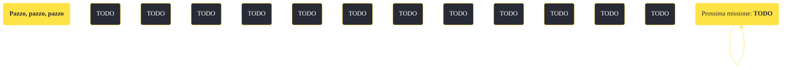

---
# Title, summary, and page position.
linktitle: "Pazzo, pazzo, pazzo"
summary: ""
weight: 10
icon: message-question
icon_pack: fas

# Page metadata.
title: "Pazzo, pazzo, pazzo"
date: 2022-11-15
type: book # Do not modify.
commentable: true
tags: "Missioni secondarie di Fallout: New Vegas"
hidden: true # Visibile nella sidebar
private: false # Nascosto dalle ricerche
---

*Pazzo, pazzo, pazzo* è una missione secondaria di Fallout: New Vegas. È data da Neil a Black Mountain.

<section class="chart-collapse">
<input type="checkbox" name="collapse2" id="handle2">
<h3 class="handle">
<label for="handle2">Clicca per mostrare il diagramma</label>
</h3>

</section>

| Tappe |       Stato        | Descrizione |
|:-----:|:------------------:| ----------- |
|                           10                          | :white_check_mark: | Sali sulla cima di Black Mountain e metti fine al regno di terrore di Tabitha.                                                                                              |
|                           20                          |            | (Opzionale) Incontra Neil al villaggio vicino alla cima di Black Mountain.                                                                                                  |

**Sfide abilità**:
- **Eloquenza 50**: per convincere Neil ad accompagnare il Corriere fino in cima a Black Mountain
- E**loquenza 75**: per usare la ricetrasmittente, all'interno dell'edificio a forma di cupola
- **Scienza 60**: per riparare Rhonda

