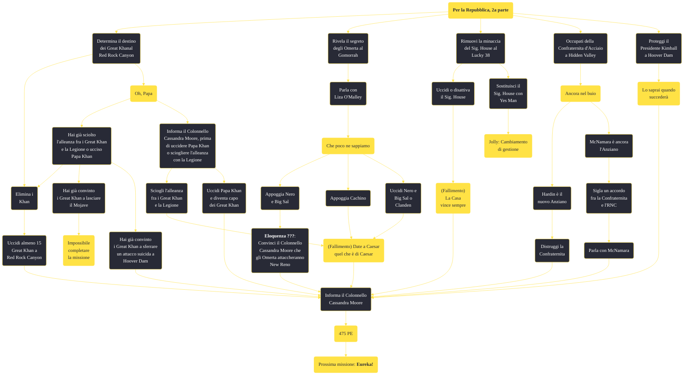

---
# Title, summary, and page position.
linktitle: "Per la Repubblica, 2a parte"
summary: ""
weight: 10
icon: message-question
icon_pack: fas

# Page metadata.
title: "Per la Repubblica, 2a parte"
date: 2022-11-15
type: book # Do not modify.
commentable: true
tags: "Missioni principali di Fallout: New Vegas"
hidden: true # Visibile nella sidebar
private: false # Nascosto dalle ricerche
---

*Per la Repubblica, 2a parte* è una missione principale di Fallout: New Vegas. È data dal Colonnello Cassandra Moore a Hoover Dam.

<section class="chart-collapse">
<input type="checkbox" name="collapse2" id="handle2">
<h3 class="handle">
<label for="handle2">Clicca per mostrare il diagramma</label>
</h3>

</section>

| Tappe |       Stato        | Descrizione |
|:-----:|:------------------:| ----------- |
|                           10                          |            | Incontra il Colonnello Moore a Hoover Dam per ricevere i prossimi incarichi.                                                                                                |
|                           20                          |            | Vai dai Great Khan nel Red Rock Canyon e assicurati il loro aiuto o distruggili.                                                                                            |
|                           25                          |            | Torna dal Colonnello Moore per riferirle che i Great Khan aiuteranno a combattere la Legione.                                                                               |
|                           26                          |            | Torna dal Colonnello Moore per riferirle che i Great Khan sono stati distrutti.                                                                                             |
|                           27                          |            | Parla con Liza O'Malley all'Ambasciata dell'RNC sulla Strip per ricevere indizi sugli Omerta.                                                                               |
|                           30                          |            | Indaga sugli Omerta e fermali se i loro piani vanno a scapito dell'RNC.                                                                                                     |
|                           35                          |            | Torna dal Colonnello Moore e riferiscile che i piani degli Omerta sono stati sventati.                                                                                      |
|                           36                          |            | Torna dal Colonnello Moore e menti riguardo ai piani degli Omerta.                                                                                                          |
|                           40                          |            | Elimina la minaccia del Sig. House per l'RNC.                                                                                                                               |
|                           42                          |            | Ottieni la Lucky 38 VIP Keycard.                                                                                                                                            |
|                           45                          |            | Torna dal Colonnello Moore e riferiscile che il Sig. House non è più una minaccia.                                                                                          |
|                           50                          |            | Trova il capitolo della Confraternita d'Acciaio in questa area e occupati di loro.                                                                                          |
|                           55                          |            | Torna dal Colonnello Moore e riferiscile che il capitolo della Confraternita d'Acciaio è stato distrutto.                                                                   |
|                           56                          |            | Torna dal Colonnello Moore e riferiscile che la Confraternita appoggerà l'RNC contro la Legione di Caesar.                                                                  |
|                           60                          |            | Parla al Mercenario Grant della protezione del Presidente Kimball durante la sua visita.                                                                                    |
|                           65                          | :white_check_mark: | Torna dal Colonnello Moore e riferiscile che il Presidente Kimball è ripartito sano e salvo.                                                                                |
|                           66                          | :white_check_mark: | Torna dal Colonnello Moore e riferiscile che il Presidente Kimball è morto.                                                                                                 |
|                           70                          |            | Vai dal Generale Oliver.                                                                                                                                                    |

**Sfide abilità**:
- **Baratto 45**/**Eloquenza 53**: per convicere Big Sal a saldare il debito di Troike
- **Baratto 55**: per ottenere la chiave della stanza di Cachino per soli 200 tappi
- **Baratto 60**: per estorcere 200 tappi a Cachino
- **Eloquenza 70**: per convincere Troike a piazzare personalmente la termite
- **Eloquenza 75**: per rivelare davanti ai Khan le vere intenzioni di Karl
- **Eloquenza 80**: per convincere Troike a sabotare gli Omerta (perdendo karma)
- **Eloquenza 80**: per convincere Cachino a vedersela da solo con i boss
- **Scienza 75**: per entrare nell'anticamera di House, senza una House Vip Key Card o il Platinum Chip

**Note**:
- Se si ha deciso di intraprendere la linea di missioni di Yes Man, ad un certo punto risulterà impossibile salvare il Presidente Kimball, o perché la reputazione con l'RNC sarà diventata troppo bassa o perché egli stesso lo vorrà morto, facendo fallire la missione Lo saprai quando succederà. Il gioco tuttavia sembra che continui a considerare Kimball vivo e le truppe RNC lo aspetteranno a Hoover Dam per il discorso; lasciando Hoover Dam e tornando da Moore, ci darà la ricompensa come se lo avessimo salvato
- Se si ottiene questa missione prima da Yes Man che dal Colonnello Moore, il Corriere deve completarla per lui; Moore gli chiederà di proteggere il Presidente, ma il Mercenario Grant non avrà nessuna opzione di dialogo, rendendo impossibile il completamente di tale missione: per evitare questo bug è consigliabile non parlare a Yes Man completamente ed evitare che assegni al giocatore la missione
- Completando *La Casa vince sempre, IV*, questa missione fallirà; va notato che se il giocatore ha già iniziato Che poco ne sappiamo, quando finirà *La Casa vince sempre, III* completerà in automatico anche *La Casa vince sempre, IV*, fallendo però quest'ultima
- Non sarà possibile scendere a patti con i Gret Khan se si ha già ultimato in precedenza *Oh, Papa*
Se si ha già completato *Oh, Papa*, non sarà possibile parlare a Moore di Regis e di una possibile alleanza con i Khan; l'unico modo per proseguire è resettare la missione con il comando `resetquest 00140c3a`
- Se i Great Khan sono stati convinti a lasciare il Mojave, è possibile informare Moore che non daranno più problemi

