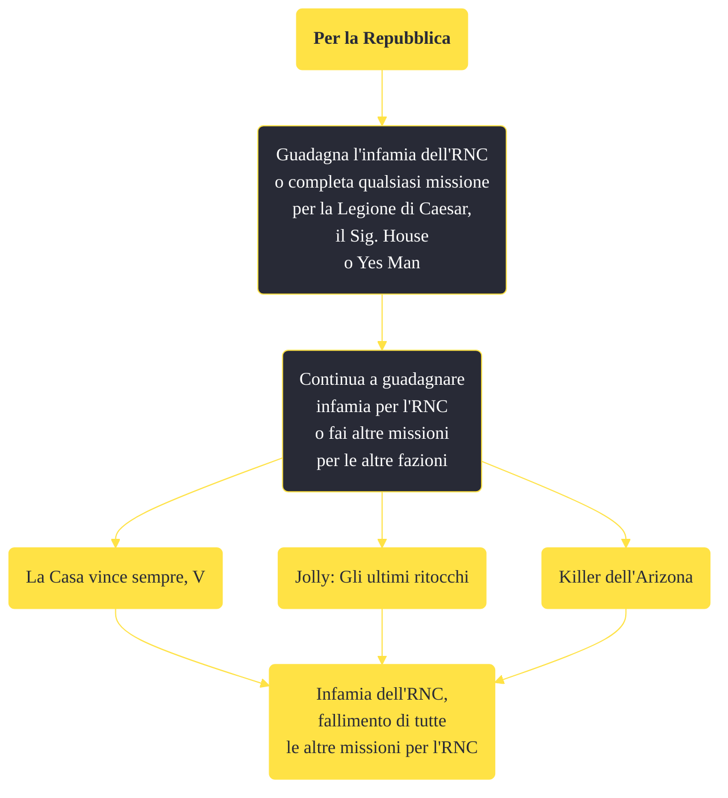

---
# Title, summary, and page position.
linktitle: "Per la Repubblica"
summary: ""
weight: 10
icon: message-question
icon_pack: fas

# Page metadata.
title: "Per la Repubblica"
date: 2022-11-15
type: book # Do not modify.
commentable: true
tags: "Missioni secondarie di Fallout: New Vegas"
hidden: true # Visibile nella sidebar
private: false # Nascosto dalle ricerche
---

*Per la Repubblica* è una missione secondaria di Fallout: New Vegas. È data da guadagnando fama con l'RNC.

<section class="chart-collapse">
<input type="checkbox" name="collapse2" id="handle2">
<h3 class="handle">
<label for="handle2">Clicca per mostrare il diagramma</label>
</h3>

</section>

| Tappe |       Stato        | Descrizione |
|:-----:|:------------------:| ----------- |
|                           5                           |            | La Repubblica della Nuova California paga bene le informazioni. Se continuerai a lavorare per la Legione, l'RNC ti marchierà come terrorista.                               |
|                           10                          |   ❌  | La Repubblica della Nuova California ti vede come un terrorista al servizio della Legione di Caesar. Nell'area dell'RNC, ti spareranno a vista.                             |
|                           15                          |            | L'RNC ha una potente rete di informatori. Se tu continui a lavorare per il sig. House, L'RNC non accetterà più il tuo aiuto.                                                |
|                           25                          |            | L'RNC ha una potente rete di informatori. Se tu continui a lavorare per il sig. House o per Yes Man, L'RNC non accetterà più il tuo aiuto.                                  |
|                           30                          |   ❌  | L'RNC sa che tu stai lavorando contro i suoi interessi e non accetterà più il tuo aiuto.                                                                                    |

**Note**:
- Se l'Ambasciatore Dennis Crocker o il Colonnello Cassandra Moore muoiono, il Corriere verrà bandito dall'RNC
- Proseguendo la trama per la Legione di Caesar, il Sig. House o Yes Man, è inevitabile fallire questa missione; è tuttavia possibile proseguire con la trama di Yes Man fino all'assalto alla sottostazione di El Dorado, la distruzione della Confraternita d'Acciaio o al discorso del Presidente Kimball

