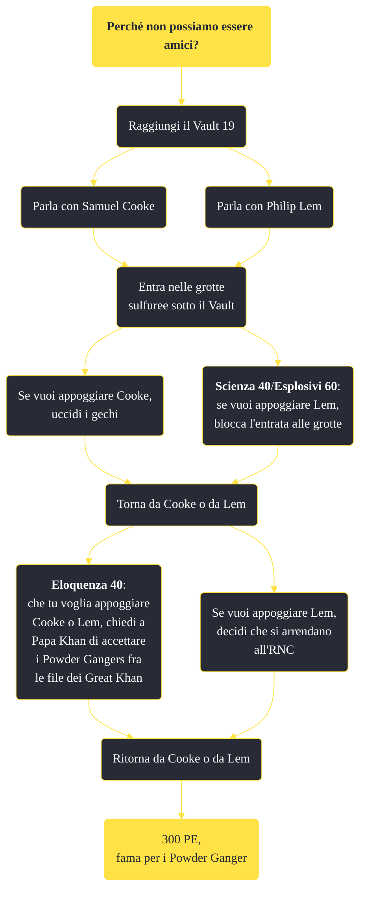

---
# Title, summary, and page position.
linktitle: "Perché non possiamo essere amici?"
summary: ""
weight: 10
icon: message-question
icon_pack: fas

# Page metadata.
title: "Perché non possiamo essere amici?"
date: 2022-11-15
type: book # Do not modify.
commentable: true
tags: "Missioni secondarie di Fallout: New Vegas"
hidden: true # Visibile nella sidebar
private: false # Nascosto dalle ricerche
---

*Perché non possiamo essere amici?* è una missione secondaria di Fallout: New Vegas. È data da Philip Lem o Samuel Cooke al Vault 19.

<section class="chart-collapse">
<input type="checkbox" name="collapse2" id="handle2">
<h3 class="handle">
<label for="handle2">Clicca per mostrare il diagramma</label>
</h3>

</section>

| Tappe |       Stato        | Descrizione |
|:-----:|:------------------:| ----------- |
|                           10                          |            | Elimina i gechi del fuoco nelle caverne sotto il Vault.                                                                                                                     |
|                           20                          |            | Trova un modo per bloccare l'accesso allo zolfo.                                                                                                                            |
|                           30                          |            | Fai rapporto a Samuel Cooke.                                                                                                                                                |
|                           40                          |            | Fai rapporto a Phillip Lem.                                                                                                                                                 |
|                           50                          |            | Parla con Papa Khan a Red Rock Canyon.                                                                                                                                      |
|                           60                          | :white_check_mark: | Fai rapporto a Samuel Cooke.                                                                                                                                                |
|                           70                          | :white_check_mark: | Fai rapporto a Phillip Lem.                                                                                                                                                 |

**Sfide abilità**:
- **Scienza 40**/**Esplosivi 60**: per bloccare l'accesso alle grotte sulfuree
- **Eloquenza 40**: per convincere il gruppo di sbandati a unirsi ai Great Khan

**Note**:
- Le tre cariche di C-4 sono tutte presenti all'interno del Vault: 
  - una nella clinica dietro la scrivania
  - una nella caffetteria fra due distributori
  - una nel passaggio sotterraneo dell'ufficio del Soprintendente
  - una nel settore blu, sotto un divanetto
- Sebbene il gruppo nel Vault 19 sia a tutti gli effetti parte dei Powder Ganger, avere una bassa reputazione con questi non rende impossibile ottenere questa missione; tuttavia completandola verrà ottenuta fama per i Power Ganger
- Uccidere Papa Khan farà fallire immediatamente questa missione
- Avere Boone come seguace può causare notevoli problemi, poiché attaccherà i Ganger o i Khan a vista 

