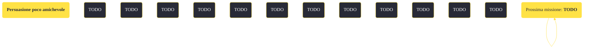

---
# Title, summary, and page position.
linktitle: "Persuasione poco amichevole"
summary: ""
weight: 10
icon: message-question
icon_pack: fas

# Page metadata.
title: "Persuasione poco amichevole"
date: 2022-11-15
type: book # Do not modify.
commentable: true
tags: "Missioni secondarie di Fallout: New Vegas"
hidden: true # Visibile nella sidebar
private: false # Nascosto dalle ricerche
---

*Persuasione poco amichevole* è una missione secondaria di Fallout: New Vegas. È data da Marcus a Jacobstown.

<section class="chart-collapse">
<input type="checkbox" name="collapse2" id="handle2">
<h3 class="handle">
<label for="handle2">Clicca per mostrare il diagramma</label>
</h3>

</section>

| Tappe |       Stato        | Descrizione |
|:-----:|:------------------:| ----------- |
|                           10                          |            | Parla con il leader dei mercenari che molestano Jacobstown.                                                                                                                 |
|                           20                          |            | Raggiungi un accordo pacifico con i mercenari.                                                                                                                              |
|                           25                          |            | (Opzionale) Elimina i mercenari.                                                                                                                                            |
|                           30                          |            | (Opzionale) Chiedi denaro a Marcus per pagare i mercenari.                                                                                                                  |
|                           40                          | :white_check_mark: | Torna da Marcus.                                                                                                                                                            |

**Sfide abilità**:
- **Eloquenza 65**: per convincere i mercenari a lasciare Jacobstown

**Note**:
- È possibile uccidere i mercenari furtivamente, senza ripercussioni negative, come è possibile ottenere i soldi da Marcus e poi sfruttare la sfida Eloquenza per allontanarli 

