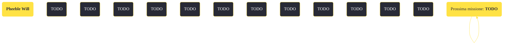

---
# Title, summary, and page position.
linktitle: "Pheeble Will"
summary: ""
weight: 10
icon: message-question
icon_pack: fas

# Page metadata.
title: "Pheeble Will"
date: 2022-11-15
type: book # Do not modify.
commentable: true
tags: "Missioni secondarie di Fallout: New Vegas"
hidden: true # Visibile nella sidebar
private: false # Nascosto dalle ricerche
---

*Pheeble Will* è una missione secondaria di Fallout: New Vegas. È data da Walter Phebus alla Stazione Las Vegas Boulevard sulla Strip.

<section class="chart-collapse">
<input type="checkbox" name="collapse2" id="handle2">
<h3 class="handle">
<label for="handle2">Clicca per mostrare il diagramma</label>
</h3>

</section>

| Tappe |       Stato        | Descrizione |
|:-----:|:------------------:| ----------- |
|                           10                          |            | Scopri il motivo della visita di Heck Gunderson all'Ultra-Luxe.                                                                                                             |
|                           15                          |            | Parla con Walter Phebus della dipartita di Heck Gunderson.                                                                                                                  |
|                           20                          |            | Heck Gunderson sta cercando suo figlio scomparso. Parlane con Walter Phebus.                                                                                                |
|                           25                          |            | (Opzionale) Ethel Phebus vuole che suo marito, Walter, dimentichi Heck Gunderson e torni al loro ranch.                                                                     |
|                           29                          |            | Parla con Walter Phebus quando sei pronto per aiutarlo.                                                                                                                     |
|                           30                          |            | Occupati di Ted Gunderson per conto di Walter Phebus.                                                                                                                       |
|                           40                          |            | Occupati di Heck Gunderson per conto di Walter Phebus.                                                                                                                      |
|                           50                          |            | Occupati di Heck e Ted Gunderson per conto di Walter Phebus.                                                                                                                |
|                           55                          | :white_check_mark: | Ted è morto. Occupati di Heck Gunderson.                                                                                                                                    |
|                           60                          |            | Ted è spacciato. Parlane con Walter.                                                                                                                                        |
|                           65                          |            | Heck è morto. Occupati di Ted Gunderson.                                                                                                                                    |
|                           70                          |            | Heck Gunderson è morto. Parlane con Walter.                                                                                                                                 |
|                           80                          |            | Heck e Ted Gunderson sono stati sistemati. Parlane con Walter.                                                                                                              |
|                           90                          |            | Walter ha messo da parte la sua sete di vendetta e potrà tornare al ranch con Ethel.                                                                                        |
|                          100                          |            | Walter è morto. Non potrai più aiutare lui o Ethel.                                                                                                                         |
|                          110                          |            | Ethel è morta. Non potrai più aiutare lei o Walter.                                                                                                                         |
|                          120                          |            | Walter si è rallegrato della dipartita di Heck Gunderson. Ha deciso di riportare Ethel a casa con sé.                                                                       |
|                          125                          |            | Contro la volontà di Ethel, Walter si è rallegrato della dipartita di Heck Gunderson. Ha deciso di riportare Ethel a casa con lui.                                          |
|                          127                          |            | Walter ha appreso con gioia delle sofferenze di Heck Gunderson, ma gli è dispiaciuto per la morte di Ted. Ha deciso di riportare Ethel a casa con sé.                       |
|                          130                          | :white_check_mark: | I Gunderson sono sistemati. Walter è stato felice della notizia e ha riportato Ethel a casa con lui.                                                                        |

**Sfide abilità**:
- **Baratto 70**: accettare la missione da Phebus e ricevere 400 tappi
- **Baratto 80**: convincere Phebus che basta uccidere Ted e lasciare in vita il padre
- **Baratto 90**: convincere Phebus che basta uccidere Heck e risparmiare il figlio, guadagnando 1000 tappi
- **Eloquenza 75**: far desistere Phebus
- **Percezione 7**: convincere Phebus a tornare a casa

**Note**:
- Accettando e proseguendo questa missione ci saranno delle conseguenze nel completamento della missione *Oltre il manzo*
- Riportando Heck da Ted durante la missione *Oltre il manzo*, la missione fallirà; Walter e Ethel spariranno dal gioco, anche se il giocatore uccide subito dopo Heck 
- Se si vuole assecondare la Legione di Caesar nella battaglia finale, ha senso uccidere Heck (con o senza il figlio), poiché non interferisce in *Date a Caesar quello che è di Caesar*

