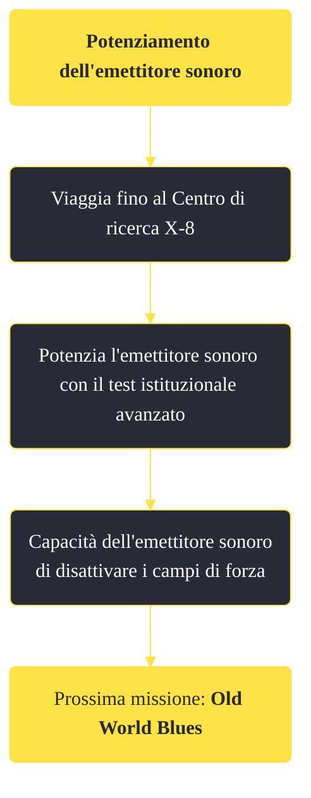

---
# Title, summary, and page position.
linktitle: "Potenziamento dell'emettitore sonoro" 
summary: ""
weight: 10
icon: message-question
icon_pack: fas

# Page metadata.
title: "Potenziamento dell'emettitore sonoro"
date: 2022-11-15
type: book # Do not modify.
commentable: true
tags: "Missioni di Old World Blues"
hidden: true # Visibile nella sidebar
private: false # Nascosto dalle ricerche
---

*Potenziamento dell'emettitore sonoro* è una missione del DLC *Old World Blues* di Fallout: New Vegas. È data dal dottor Klein al Serbatoio del pensiero.

**Riassunto**:
1. Viaggia fino al Centro di ricerca X-8
2. Potenzia l'emettitore sonoro con il test istituzionale avanzato
3. Ricompensa: capacità dell'emettitore sonoro di disattivare i campi di forza
4. Prossima missione: *Old World Blues*

<section class="chart-collapse">
<input type="checkbox" name="collapse2" id="handle2">
<h3 class="handle">
<label for="handle2">Clicca per mostrare il diagramma</label>
</h3>

</section>

| Tappe |       Stato        | Descrizione |
|:-----:|:------------------:| ----------- |
|                           10                          |            | Vai al Centro di ricerca X-8 per trovare il campo di forza che sta disgregando il potenziamento di onde a impulsi EM per l'emettitore sonoro.                               |
|                           20                          |            | Avvia il test istituzionale al terminale di test X-8.                                                                                                                       |
|                           30                          |            | Trova i registri dei tre studenti nei terminali della Struttura istituzionale X-8.                                                                                          |
|                           40                          |            | Lascia la Struttura istituzionale X-8 dall'uscita del piano superiore.                                                                                                      |
|                           50                          |            | Avvia il test istituzionale avanzato al terminale di test X-8.                                                                                                              |
|                           60                          |            | Potenzia l'emettitore sonoro.                                                                                                                                               |
|                           70                          | :white_check_mark: | Prova le onde a impulsi EM per l'emettitore sonoro in un campo di forza.                                                                                                    |

**Note**:
- Questa missione può essere completata assieme a *Orrore da liceo X-8!*

