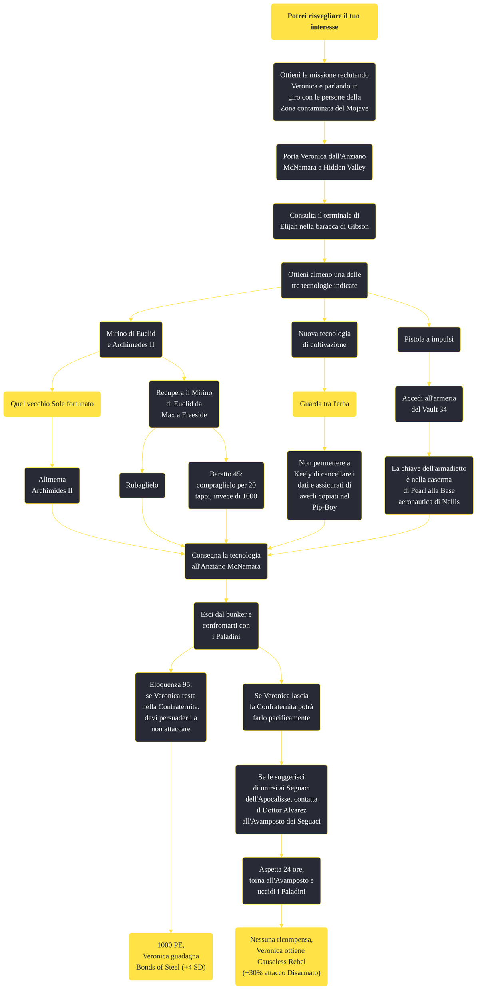

---
# Title, summary, and page position.
linktitle: "Potrei risvegliare il tuo interesse"
summary: ""
weight: 10
icon: message-question
icon_pack: fas

# Page metadata.
title: "Potrei risvegliare il tuo interesse"
date: 2022-11-15
type: book # Do not modify.
commentable: true
tags: "Missioni secondarie di Fallout: New Vegas"
hidden: true # Visibile nella sidebar
private: false # Nascosto dalle ricerche
---

*Potrei risvegliare il tuo interesse* è una missione secondaria di Fallout: New Vegas. È data da Veronica.

<section class="chart-collapse">
<input type="checkbox" name="collapse2" id="handle2">
<h3 class="handle">
<label for="handle2">Clicca per mostrare il diagramma</label>
</h3>

</section>

| Tappe |       Stato        | Descrizione |
|:-----:|:------------------:| ----------- |
|                           10                          |            | Vai con Veronica a parlare con l'Anziano della Confraternita d'Acciaio a Hidden Valley.                                                                                     |
|                           20                          |            | Torna con Veronica dall'Anziano della Confraternita d'Acciaio con prove delle fuorvianti priorità della Confraternita.                                                      |
|                           25                          |            | Accedi alle note di Father Elijah nel terminale di comunicazione con Veronica.                                                                                              |
|                           30                          |            | Visita il banco dei pegni a Freeside e il negozio di articoli da regolo del Vault 21 con Veronica.                                                                          |
|                           40                          |            | Cerca l'uomo che ha comprato il telemetro a Freeside vicino al negozio di Mick e Ralph.                                                                                     |
|                           50                          |            | Chiedi in giro per scoprire che fine ha fatto il telemetro.                                                                                                                 |
|                           60                          |            | Recupera il telemetro.                                                                                                                                                      |
|                           70                          |            | Trova un modo per attivare il telemetro all'HELIOS One.                                                                                                                     |
|                           80                          |            | Porta il telemetro all'Anziano nella Hidden Valley.                                                                                                                         |
|                           90                          |            | Parla con il direttore dell'OSI del suo progetto di ricerca.                                                                                                                |
|                          100                          |            | Recupera i dati sperimentali del Vault 22.                                                                                                                                  |
|                          110                          |            | Riporta i dati all'Anziano nella Hidden Valley.                                                                                                                             |
|                          120                          |            | Cerca informazioni sulla pistola a impulsi alla base aeronautica di Nellis.                                                                                                 |
|                          130                          |            | Recupera la pistola a impulsi dal Vault 34 se ancora esiste.                                                                                                                |
|                          140                          |            | Riporta la pistola a impulsi all'Anziano nella Hidden Valley.                                                                                                               |
|                          150                          |            | Fai controllare a Veronica l'avamposto dei Seguaci dell'Apocalisse.                                                                                                         |
|                          160                          |            | Torna all'avamposto dei Seguaci dell'Apocalisse quando il Dott. Schiller si trova lì.                                                                                       |
|                          170                          |            | Parla con Veronica                                                                                                                                                          |
|                          200                          | :white_check_mark: | Discuti le opzioni che ti restano con Veronica.                                                                                                                             |

**Sfide abilità**:
- **Baratto 45**: per spendere solo 25 tappi per ottenere il Mirino di Euclid da Max a Freeside
- **Eloquenza 95**: per convincere i paladini a far restare Veronica nella Confraternita
- **Presenza terrificante**: per spaventare i paladini, facendo però fallire la missione

**Note**:
- Per progredire nella missione è necessario eseguire almeno 3 delle 10 azioni seguenti, mentre si è in compagnia di Veronica:
  - parlando con Anderson agli Appartamenti Casa Madrid, nello specifico dei suoi legami con i Seguaci dell'Apocalisse e la sua confessione dell'omicidio del Caporale White
  - scendendo per la rampa del Vault 3
  - visitando il Vault 34
  - andando a Nelson o Cottonwood Cove
  - superando la tripla porta del terminal di Camp McCarran
  - parlando con Thomas Hildern
  - ascoltando la storia dei Boomer da Pete alla Base aeronautica di Nellis
  - parlando con Julie Farkas, per la prima volta, all'Old Mormon Fort
  - discutendo con Jason Bright al Sito test REPCONN sul "Grande Viaggio"
  - conversando con Gloria Van Graff al Silver Rush
- Se hai già completato *Quel vecchio Sole fortunato* non divergendo la corrente verso Archimedes II, non sarà possibile utilizzare questa tecnologia per progredire nella missione
- Durante *Guarda tra l'erba*, non bisognerà permettere a Keely di cancellare i dati ma assicurarsi di averli copiati nel Pip-Boy

