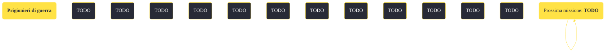

---
# Title, summary, and page position.
linktitle: "Prigionieri di guerra"
summary: ""
weight: 10
icon: message-question
icon_pack: fas

# Page metadata.
title: "Prigionieri di guerra"
date: 2022-11-15
type: book # Do not modify.
commentable: true
tags: "Missioni di Honest Hearts"
hidden: true # Visibile nella sidebar
private: false # Nascosto dalle ricerche
---

*Prigionieri di guerra* è una missione del DLC *Honest Hearts* di Fallout: New Vegas. È data da Joshua Graham.

<section class="chart-collapse">
<input type="checkbox" name="collapse2" id="handle2">
<h3 class="handle">
<label for="handle2">Clicca per mostrare il diagramma</label>
</h3>

</section>

| Tappe |       Stato        | Descrizione |
|:-----:|:------------------:| ----------- |
|                           10                          |            | Libera i Tormenti prigionieri nella Sottostazione Mercenari Osprey.                                                                                                         |
|                           20                          | :white_check_mark: | Opzionale: Uccidi gli Zampabianca alla Sottostazione Mercenari Osprey.                                                                                                      |
|                           30                          | :white_check_mark: | Trova la chiave della cella.                                                                                                                                                |

**Sfide abilità**:
- **Scasso 75**: per scassinare la serratura della cella (la chiave si trova su una cassetta degli attrezzi, nella torre della sottostazione Mercenari Osprey) 

**Note**:
- Questa missione viene data simultaneamente con *Fuga da Zion*, *Riconquista il ponte* e *Santità dei morti*
- Liberandoli, i Tormenti ti aiuteranno a sconfiggere gli Zampabianca rimasti, ma se uno di essi muore non sarà poi possibile completare la missione *Fuga da Zion*

