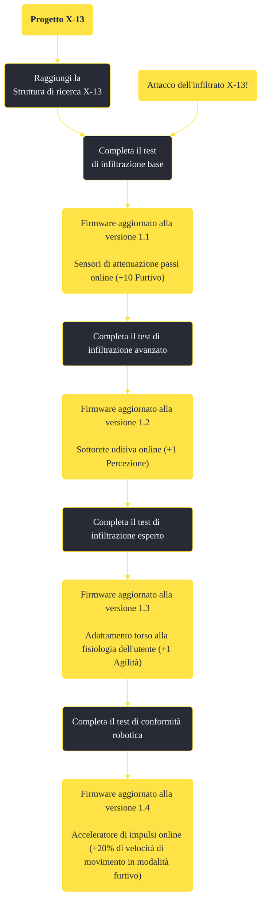

---
# Title, summary, and page position.
linktitle: "Progetto X-13" 
summary: ""
weight: 10
icon: message-question
icon_pack: fas

# Page metadata.
title: "Progetto X-13"
date: 2022-11-15
type: book # Do not modify.
commentable: true
tags: "Missioni di Old World Blues"
hidden: true # Visibile nella sidebar
private: false # Nascosto dalle ricerche
---

*Progetto X-13* è una missione del DLC *Old World Blues* di Fallout: New Vegas. È data dal terminale del test alla struttura di ricerca X-13.

**Riassunto**:
1. Raggiungi la Struttura di ricerca X-13
2. Completa: *Attacco dell'infiltrato X-13!*
3. Completa il test di infiltrazione base: Sensori di attenuazione passi online (+10 Furtivo)
4. Completa il test di infiltrazione avanzato: Sottorete uditiva online (+1 Percezione)
5. Completa il test di infiltrazione esperto: Adattamento torso alla fisiologia dell'utente (+1 Agilità)
6. Completa il test di conformità robotica: Acceleratore di impulsi online (+20% di velocità di movimento in modalità furtivo)

<section class="chart-collapse">
<input type="checkbox" name="collapse2" id="handle2">
<h3 class="handle">
<label for="handle2">Clicca per mostrare il diagramma</label>
</h3>

</section>

| Tappe |       Stato        | Descrizione |
|:-----:|:------------------:| ----------- |
|                           5                           |            | Torna al terminale di sperimentazione.                                                                                                                                      |
|                           10                          |            | Assembla la tuta mimetica sperimentale.                                                                                                                                     |
|                           20                          |            | Completa il test di infiltrazione di base.                                                                                                                                  |
|                           25                          |            | Completa il replay del test di infiltrazione di base.                                                                                                                       |
|                           30                          |            | Completa il test di infiltrazione avanzato.                                                                                                                                 |
|                           35                          |            | Completa il replay del test di infiltrazione avanzato.                                                                                                                      |
|                           40                          |            | Completa il test di infiltrazione esperto.                                                                                                                                  |
|                           45                          |            | Completa il replay del test di infiltrazione per esperti.                                                                                                                   |
|                           50                          |            | Completa il test di conformità robotica.                                                                                                                                    |
|                           55                          |            | Completa il replay del test di conformità robotica.                                                                                                                         |
|                          100                          | :white_check_mark: | [Opzionale] Completa tutti i test dell'X-13.                                                                                                                                |

**Sfide abilità**:
- **Scienza 50**: per disattivare permanentemente le trappole

**Note**:
- L'area di osservazione della struttura ha parecchi Stealth Boy, utili per completare agevolmente il test
- Il monitor della tuta X-13 evidenzia il percorso ottimale per finire il test
- I bonus ottenuti sono cumulativi: il livello di furtività della tuta sale quindi a +25

