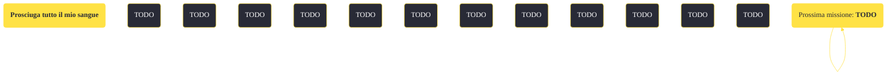

---
# Title, summary, and page position.
linktitle: "Prosciuga tutto il mio sangue"
summary: ""
weight: 10
icon: message-question
icon_pack: fas

# Page metadata.
title: "Prosciuga tutto il mio sangue"
date: 2022-11-15
type: book # Do not modify.
commentable: true
tags: "Missioni secondarie di Fallout: New Vegas"
hidden: true # Visibile nella sidebar
private: false # Nascosto dalle ricerche
---

*Prosciuga tutto il mio sangue* è una missione secondaria di Fallout: New Vegas. È data da Red Lucy al The Thorn.

<section class="chart-collapse">
<input type="checkbox" name="collapse2" id="handle2">
<h3 class="handle">
<label for="handle2">Clicca per mostrare il diagramma</label>
</h3>

</section>

| Tappe |       Stato        | Descrizione |
|:-----:|:------------------:| ----------- |
|                           10                          |            | Red Lucy ha bisogno di uova di mantide gigante. Ci vuole meno tempo a raccorglierle in un impianto di riproduzione come Vault 22.                                           |
|                           20                          |            | Torna da Red Lucy con le uova di mantide gigante.                                                                                                                           |
|                           30                          |            | Red Lucy vuole uova di scorpione radioattivo. Ha suggerito di cercarle nelle montagne a nord di Goodsprings.                                                                |
|                           40                          |            | Torna da Red Lucy con le uova di scorpione radioattivo.                                                                                                                     |
|                           50                          |            | Red Lucy vuole delle uova di geco di fuoco. Ha consigliato di cercare vicino a Ireteba Peaks.                                                                               |
|                           60                          |            | Torna da Red Lucy con le uova del geco di fuoco.                                                                                                                            |
|                           70                          |            | I cacciatori di elite di The Thorn stanno cercando uova di Nightstalker. Red Lucy consiglia di guardare in una caverna nei pressi di Bittersprings..                        |
|                           80                          |            | Torna da Red Lucy con le uova di Nightstalker.                                                                                                                              |
|                           90                          |            | I cacciatori di elite di The Thorn sono attualmente alla ricerca di uova di Cazador. Red Lucy consiglia di cercarle nei pressi di Red Rocks.                                |
|                          100                          |            | Torna da Red Lucy con le uova di Cazador.                                                                                                                                   |
|                          110                          |            | Red Lucy ha assegnato il compito più pericoloso che esista per un cacciatore. Vuole delle uova di Deathclaw per The Thorn.                                                  |
|                          120                          |            | Torna da Red Lucy con le uova di Deathclaw.                                                                                                                                 |
|                          130                          | :white_check_mark: | Sei il più grande cacciatore della storia di The Thorn.                                                                                                                     |
|                          140                          |   ❌  | Red Lucy è morta. Non potrai più aiutarla.                                                                                                                                  |

**Sfide abilità**:
- **Baratto 50**/**60**/**70**/**80**/**90**: per guadagnare fino a 1200 tappi in più

**Note**:
- In questa missione dovrai affrontare creature temibili e leggendarie (nightstalker, cazador e deathclaw), molto forti e in spazi chiusi (grotte e canyon)

