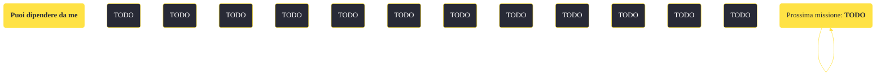

---
# Title, summary, and page position.
linktitle: "Puoi dipendere da me"
summary: ""
weight: 10
icon: message-question
icon_pack: fas

# Page metadata.
title: "Puoi dipendere da me"
date: 2022-11-15
type: book # Do not modify.
commentable: true
tags: "Missioni secondarie di Fallout: New Vegas"
hidden: true # Visibile nella sidebar
private: false # Nascosto dalle ricerche
---

*Puoi dipendere da me* è una missione secondaria di Fallout: New Vegas. È data da Alice McLafferty alla Crimson Caravan Company.

<section class="chart-collapse">
<input type="checkbox" name="collapse2" id="handle2">
<h3 class="handle">
<label for="handle2">Clicca per mostrare il diagramma</label>
</h3>

</section>

| Tappe |       Stato        | Descrizione |
|:-----:|:------------------:| ----------- |
|                           10                          |            | Consegna la fattura della Crimson Caravan al Dottor Hildern a Camp McCarran.                                                                                                |
|                           15                          |            | Torna da Alice McLafferty e comunicale che hai consegnato la fattura.                                                                                                       |
|                           20                          |            | Alice McLafferty, proprietaria della Crimson Caravan Company, ha ulteriori lavori disponibili.                                                                              |
|                           30                          |            | Negozia con Cass per acquistare la Cassidy Caravans per la Crimson Caravan Company.                                                                                         |
|                           35                          |            | Riferisci ad Alice McLafferty che ora la Crimson Caravan Company possiede la Cassidy Caravans.                                                                              |
|                           36                          |            | Riferisci ad Alice McLafferty che Cass è morto.                                                                                                                             |
|                           40                          |            | Convinci Henry Jamison ad abbandonare il suo posto di lavoro alla Crimson Caravan Company.                                                                                  |
|                           45                          |            | Comunica ad Alice McLafferty che Henry Jamison ha abbandonato il suo posto di lavoro.                                                                                       |
|                           50                          |            | (Opzionale) Recupera le specifiche di produzione segrete dei Gun Runner dalla loro fabbrica.                                                                                |
|                           55                          | :white_check_mark: | Consegna le specifiche di produzione dei Gun Runner ad Alice McLafferty.                                                                                                    |

**Sfide abilità**:
- **Baratto 50**: per convincere Jamison a lasciare il suo lavoro e guadagnare fino a 400 tappi
- **Eloquenza 50**: per convincere Jamison a lasciare il suo lavoro e guadagnare fino a 500 tappi

**Note**:
- Completando *Guarda tra l'erba* un bug renderà impossibile consegnare la fattura a Thomas Hildern; è quindi consigliato prima consegnargliela e poi completare la missione *Guarda tra l'erba*
- Se la parte che riguarda Cass viene risolta non violentemente, ci saranno delle conseguenze per la missione *Heartache by the Number*

