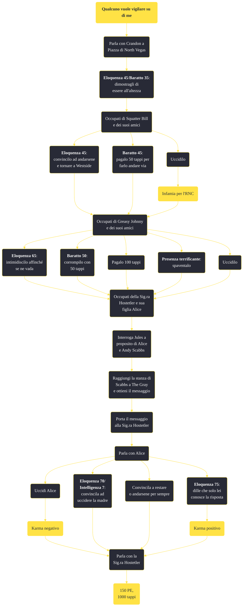

---
# Title, summary, and page position.
linktitle: "Qualcuno vuole vigilare su di me"
summary: ""
weight: 10
icon: message-question
icon_pack: fas

# Page metadata.
title: "Qualcuno vuole vigilare su di me"
date: 2022-11-15
type: book # Do not modify.
commentable: true
tags: "Missioni secondarie di Fallout: New Vegas"
hidden: true # Visibile nella sidebar
private: false # Nascosto dalle ricerche
---

*Qualcuno vuole vigilare su di me* è una missione secondaria di Fallout: New Vegas. È data da Crandon alla piazza di North Vegas.

**Riassunto**:
1. Parla con Crandon a Piazza di North Vegas
2. **Eloquenza 45**/**Baratto 35**: dimostragli di essere all'altezza
3. Occupati di Squatter Bill e dei suoi amici
   - **Eloquenza 45**: convincilo ad andarsene e tornare a Westside
   - **Baratto 45**: pagalo 50 tappi per farlo andare via
   - Uccidilo: **infamia per l'RNC**
4. Occupati di Greasy Johnny e dei suoi amici
   - **Eloquenza 65**: intimidiscilo affinché se ne vada
   -  **Baratto 50**: corrompilo con 50 tappi
   -  Pagalo 100 tappi
   -  **Presenza terrificante**: spaventalo
   -  Uccidilo
5.  Occupati della Sig.ra Hostetler e sua figlia Alice
6.  Interroga Jules a proposito di Alice e Andy Scabbs
7.  Raggiungi la stanza di Scabbs a The Gray e ottieni il messaggio
8.  Porta il messaggio alla Sig.ra Hostetler
9.  Parla con Alice
   -  Uccidi Alice: **karma negativo**
   -  **Eloquenza 70**/**Intelligenza 7**: convincila ad uccidere la madre
   -  Convincila a restare o andarsene per sempre
   -  **Eloquenza 75**: dille che solo lei conosce la risposta: **karma positivo**
10. Parla con la Sig.ra Hostetler
11. Ricompensa: **150 PE**, **1000 tappi**

<section class="chart-collapse">
<input type="checkbox" name="collapse2" id="handle2">
<h3 class="handle">
<label for="handle2">Clicca per mostrare il diagramma</label>
</h3>

</section>

| Tappe |       Stato        | Descrizione |
|:-----:|:------------------:| ----------- |
|                           10                          |            | Occupati dei nuovi arrivati.                                                                                                                                                |
|                           15                          |            | Parla a Crandon dei nuovi arrivati.                                                                                                                                         |
|                           20                          |            | Occupati della banda di piantagrane.                                                                                                                                        |
|                           25                          |            | Parla a Crandon dei teppisti nelle fogne.                                                                                                                                   |
|                           29                          |            | Crandon è morto. Non potrai più aiutarlo.                                                                                                                                   |
|                           30                          |            | Parla con la Sig.ra Hostetler.                                                                                                                                              |
|                           40                          |            | Trova informazioni sui nuovi amici di Alice Hostetler.                                                                                                                      |
|                           45                          |            | Cerca Alice Hostetler e il suo amico, Andy, nell'edificio noto come The Gray.                                                                                               |
|                           50                          |            | Nessun segno né di Alice né di Andy. Perquisisci The Gray per trovare indizi sul loro nascondiglio.                                                                         |
|                           60                          |            | Rivela alla Sig.ra Hostetler il piano di Andy di rubare i soldi della Crimson Caravan.                                                                                      |
|                           63                          |            | (Opzionale) Aiuta Andy ad attuare il suo piano di rubare i soldi della Crimson Caravan agli Hostetler.                                                                      |
|                           70                          |            | Alice ha quasi attaccato sua madre. Ha cambiato idea e ha deciso di restare con i genitori.                                                                                 |
|                           72                          |            | Alice ha attaccato casa sua. Ha deciso di fuggire da New Vegas.                                                                                                             |
|                           74                          | :white_check_mark: | Alice ha attaccato casa sua. È morta dopo aver attaccato sua madre.                                                                                                         |
|                           76                          | :white_check_mark: | Alice ha attaccato casa sua. Dopo aver attaccato sua madre, sono morte entrambe.                                                                                            |
|                           78                          |            | Alice ha quasi attaccato sua madre, ma poi ha deciso di lasciare New Vegas e andarsene per la sua strada.                                                                   |
|                           80                          |            | Becky ed Alice sono morte, prendi i soldi della Crimson Caravan.                                                                                                            |
|                           82                          |            | Parla con la Sig.ra Hostetler.                                                                                                                                              |
|                           85                          |            | Seppur rattristata dalla fuga di Alice, la Sig.ra Hostetler ha voluto tener fede alla sua parte dell'accordo.                                                               |
|                           87                          |            | La Sig.ra Hostetler ha voluto tener fede alla sua parte dell'accordo ed è risollevata dal fatto che Alice abbia deciso di rimanere con loro.                                |
|                           88                          |            | La Sig.ra Hostetler era distrutta dopo la morte di Alice. Non potrà più essere di aiuto.                                                                                    |
|                           89                          |            | La Sig.ra Hostetler era distrutta dopo la fuga di Alice. Non potrà più essere di aiuto.                                                                                     |
|                           90                          | :white_check_mark: | Non c'era nessun denaro della Crimson Caravan.                                                                                                                              |

**Sfide abilità**:
- **Eloquenza 45**/**Baratto 35**: per convincere Crandon e iniziare la missione
- **Eloquenza 45**/**Baratto 45**: per convincere Squatter Bill ad andarsene dalle fogne (scegliendo **Baratto** si pagano 50 tappi)
- **Eloquenza 65**/**Baratto 50**: per intimorire o corrompere Greasy Johnny (scegliendo Baratto si pagano 50 tappi)
- **Eloquenza 70**/**Intelligenza 7**: per convincere o dissuadere Alice a uccidere la madre 
- **Scasso 50**: per scassinare la serratura della stanza di Andy Scabb (la chiave è nell'inventario di uno dei suoi scagnozzi)

