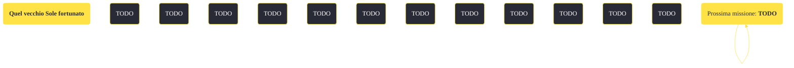

---
# Title, summary, and page position.
linktitle: "Quel vecchio Sole fortunato"
summary: ""
weight: 10
icon: message-question
icon_pack: fas

# Page metadata.
title: "Quel vecchio Sole fortunato"
date: 2022-11-15
type: book # Do not modify.
commentable: true
tags: "Missioni secondarie di Fallout: New Vegas"
hidden: true # Visibile nella sidebar
private: false # Nascosto dalle ricerche
---

*Quel vecchio Sole fortunato* è una missione secondaria di Fallout: New Vegas. È data da Fantastic o dal Luogotenente Haggerty a HELIOS One.

<section class="chart-collapse">
<input type="checkbox" name="collapse2" id="handle2">
<h3 class="handle">
<label for="handle2">Clicca per mostrare il diagramma</label>
</h3>

</section>

| Tappe |       Stato        | Descrizione |
|:-----:|:------------------:| ----------- |
|                           5                           |            | Parla con l'idiota con gli occhiali da sole sul retro dell'edificio dell'impianto di HELIOS One.                                                                            |
|                           20                          |            | Collegati al computer centrale di HELIOS One dal terminale di controllo del riflettore occidentale.                                                                         |
|                           30                          |            | Collegati al computer centrale di HELIOS One dal terminale di controllo del riflettore orientale.                                                                           |
|                           50                          |            | Ripristina l'alimentazione del computer centrale di HELIOS One mediante un generatore ausiliario.                                                                           |
|                           60                          |            | Usa il computer centrale di HELIOS One per dare alimentazione a una destinazione di tua scelta.                                                                             |
|                           65                          |            | OPZIONALE: Arma il sistema di sicurezza ARCHIMEDES per eliminare tutti i soldati dell'RNC vicini.                                                                           |
|                           70                          | :white_check_mark: | Avvia il ripuntamento del riflettore dalla console sul ponte di osservazione della torre.                                                                                   |
|                           80                          | :white_check_mark: | Parla con Fantastic.                                                                                                                                                        |
|                           90                          | :white_check_mark: | Parla con Ignacio.                                                                                                                                                          |

**Sfide abilità**:
- **Eloquenza 30**/**Scienza 30**: per ingannare i militari RNC all'netrata ed entrare nella struttura
- **Riparazione 35**: per riparare il terminale rotto con un rottame di ferro
- **Scienza 45**: per riattivare PYTHON
- **Intelligenza 7**: per convincere Arcade Gannon, nel caso fosse nostro seguace, che l'energia dell'impianto va dirottata a favore dell'RNC

**Note**:
- Per evitare bug e glitch è consigliato aspettare che il ripuntamento sia terminato, prima di uscire dall'impianto 
- È possibile attivare ARCHIMEDES I anche dopo aver terminato la missione, se non si ha scelto di erogare l'energia a tutta la regione in modalità d'emergenza 

