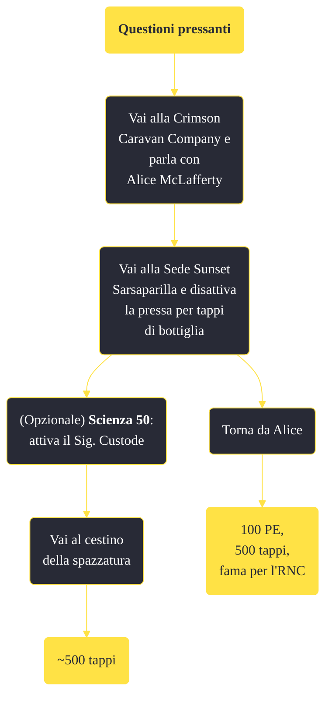

---
# Title, summary, and page position.
linktitle: "Questioni pressanti"
summary: ""
weight: 10
icon: message-question
icon_pack: fas

# Page metadata.
title: "Questioni pressanti"
date: 2022-11-15
type: book # Do not modify.
commentable: true
tags: "Missioni secondarie di Fallout: New Vegas"
hidden: true # Visibile nella sidebar
private: false # Nascosto dalle ricerche
---

*Questioni pressanti* è una missione secondaria di Fallout: New Vegas. È data da Alice McLafferty alla Crimson Caravan Company.

**Riassunto**:
1. Vai alla Crimson Caravan Company e parla con Alice McLafferty
2. Vai alla Sede Sunset Sarsaparilla e disattiva la pressa per tappi di bottiglia
3. (Opzionale) **Scienza 50**: attiva il Sig. Custode: **~500 tappi**
4. Torna da Alice
5. Ricompensa: **100 PE**, **500 tappi**, **fama per l'RNC**

<section class="chart-collapse">
<input type="checkbox" name="collapse2" id="handle2">
<h3 class="handle">
<label for="handle2">Clicca per mostrare il diagramma</label>
</h3>

</section>

| Tappe |       Stato        | Descrizione |
|:-----:|:------------------:| ----------- |
|                           10                          |            | Disattiva la pressa per tappi di bottiglia.                                                                                                                                 |
|                           20                          | :white_check_mark: | Torna da Alice McLafferty e comunicale che la pressa per tappi di bottiglia è fuori uso.                                                                                    |

**Sfide abilità**:
- **Scienza 50**: per attivare il Sig. Custode e raccogliere circa 500 tappi dal cestino della spazzatura

