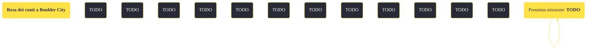

---
# Title, summary, and page position.
linktitle: "Resa dei conti a Boulder City"
summary: ""
weight: 10
icon: message-question
icon_pack: fas

# Page metadata.
title: "Resa dei conti a Boulder City"
date: 2022-11-15
type: book # Do not modify.
commentable: true
tags: "Missioni secondarie di Fallout: New Vegas"
hidden: true # Visibile nella sidebar
private: false # Nascosto dalle ricerche
---

*Resa dei conti a Boulder City* è una missione secondaria di Fallout: New Vegas. È data dal Luogotenente Monroe a Boulder City.

<section class="chart-collapse">
<input type="checkbox" name="collapse2" id="handle2">
<h3 class="handle">
<label for="handle2">Clicca per mostrare il diagramma</label>
</h3>

</section>

| Tappe |       Stato        | Descrizione |
|:-----:|:------------------:| ----------- |
|                           10                          |            | Incontra Jessup, leader dei Great Khan a Boulder City.                                                                                                                      |
|                           15                          |            | Negozia per il rilascio degli ostaggi dell'RNC.                                                                                                                             |
|                           20                          |            | Libera i soldati dell'RNC tenuti in ostaggio dai Great Khan.                                                                                                                |
|                           40                          |            | Aiuta i Great Khan ad uccidere le truppe dell'RNC alle rovine di Boulder City.                                                                                              |
|                           50                          |            | Aiuta l'RNC a uccidere tutti i Great Khan nascosti nelle rovine di Boulder City.                                                                                            |
|                           55                          | :white_check_mark: | Parla con il Luogotenente Monroe.                                                                                                                                           |
|                           60                          |            | (Opzionale) Corrompi i soldati dell'RNC convincendoli a lasciare scappare i Great Khan.                                                                                     |
|                           70                          | :white_check_mark: | Torna dal Luogotenente Monroe e informalo che hai stretto un patto con i Great Khan.                                                                                        |
|                           80                          | :white_check_mark: | Riferisci a Jessup che i Great Khan sono liberi di andare.                                                                                                                  |

**Sfide abilità**:
- **Eloquenza 45**: per convincere Jessup a liberare gli ostaggi
- **Baratto 45**: per poter corrompere con meno tappi il Luogotenente Monroe 

