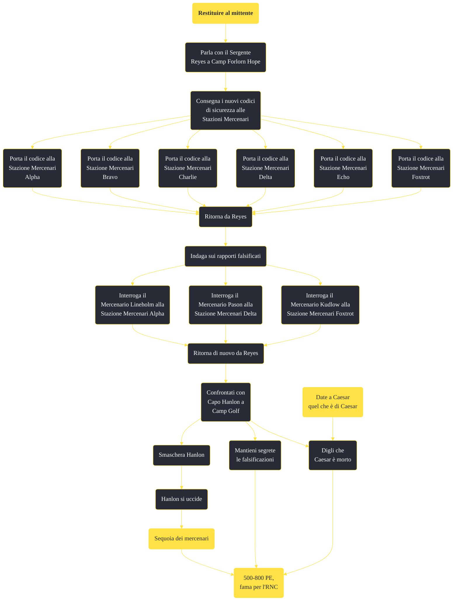

---
# Title, summary, and page position.
linktitle: "Restituire al mittente"
summary: ""
weight: 10
icon: message-question
icon_pack: fas

# Page metadata.
title: "Restituire al mittente"
date: 2022-11-15
type: book # Do not modify.
commentable: true
tags: "Missioni secondarie di Fallout: New Vegas"
hidden: true # Visibile nella sidebar
private: false # Nascosto dalle ricerche
---

*Restituire al mittente* è una missione secondaria di Fallout: New Vegas. È data dal Sergente Reyes a Camp Forlorn Hope.

<section class="chart-collapse">
<input type="checkbox" name="collapse2" id="handle2">
<h3 class="handle">
<label for="handle2">Clicca per mostrare il diagramma</label>
</h3>

</section>

| Tappe |       Stato        | Descrizione |
|:-----:|:------------------:| ----------- |
|                           10                          |            | Consegna i codici di potenziamento di sicurezza radiofonica a ognuna delle Stazioni dei Mercenari.                                                                          |
|                           11                          |            | Potenzia la Stazione dei Mercenari Alpha.                                                                                                                                   |
|                           12                          |            | Potenzia la Stazione dei Mercenari Bravo.                                                                                                                                   |
|                           13                          |            | Potenzia la Stazione dei Mercenari Charlie.                                                                                                                                 |
|                           14                          |            | Potenzia la Stazione dei Mercenari Delta.                                                                                                                                   |
|                           15                          |            | Potenzia la Stazione dei Mercenari Echo.                                                                                                                                    |
|                           16                          |            | Potenzia la Stazione dei Mercenari Foxtrot.                                                                                                                                 |
|                           20                          |            | Torna dal Sergente Reyes e comunicale che il potenziamento della sicurezza radiofonica è stato completato.                                                                  |
|                           30                          |            | Scopri cos'altro vuole che tu faccia il Sergente Reyes.                                                                                                                     |
|                           40                          |            | Conferma i sospetti del Sergente Reyes sulle voci provenienti da Camp Golf.                                                                                                 |
|                           41                          |            | Chiedi al Mercenario Lineholm delle perdite subite nella battaglia alla Stazione dei Mercenari Alpha.                                                                       |
|                           42                          |            | Scopri informazioni sull'attacco legionario dei Supermutanti alla Stazione dei Mercenari Delta.                                                                             |
|                           43                          |            | Indaga sugli attacchi di Deathclaw alla Stazione dei Mercenari Foxtrot.                                                                                                     |
|                           50                          |            | Riferisci al Sergente Reyes che i suoi sospetti sulle informazioni sbagliate divulgate all'RNC erano fondati.                                                               |
|                           60                          |            | Comunica al capo Hanlon cosa avete scoperto tu e il Sergente Reyes.                                                                                                         |
|                           70                          | :white_check_mark: | Parla con il capo Hanlon nel suo ufficio.                                                                                                                                   |
|                           80                          | :white_check_mark: | Trova un mercenario con cui arrestare il capo Hanlon.                                                                                                                       |
|                           90                          | :white_check_mark: | Uccidi il capo Hanlon.                                                                                                                                                      |

