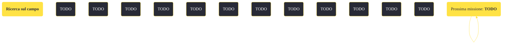

---
# Title, summary, and page position.
linktitle: "Ricerca sul campo" 
summary: ""
weight: 10
icon: message-question
icon_pack: fas

# Page metadata.
title: "Ricerca sul campo"
date: 2022-11-15
type: book # Do not modify.
commentable: true
tags: "Missioni di Old World Blues"
hidden: true # Visibile nella sidebar
private: false # Nascosto dalle ricerche
---

*Ricerca sul campo* è una missione del DLC *Old World Blues* di Fallout: New Vegas. È data dal Pozzo.

<section class="chart-collapse">
<input type="checkbox" name="collapse2" id="handle2">
<h3 class="handle">
<label for="handle2">Clicca per mostrare il diagramma</label>
</h3>

</section>

| Tappe |       Stato        | Descrizione |
|:-----:|:------------------:| ----------- |
|                           10                          |            | Trova tutti i campioni audio per il Jukebox.                                                                                                                                |
|                           20                          |            | Trova dei campioni per la Stazione di ricerca biologica.                                                                                                                    |
|                           30                          | :white_check_mark: | Riporta i campioni al Pozzo.                                                                                                                                                |

**Note**:
- Per potenziare Diodo cieco Jefferson è necessario recuperare i seguenti campioni:
  - Campione audio - Cantante d'opera e il Campione audio- Tarantola gigante nell'Higgs Village
  - Campione audio - Latrato di Gabriel nel Centro di ricerca X-8
  - Campione audio - Roboscorpione di Mobius nella Cupola della Zona proibita
- Per potenziare la Stazione di ricerca biologica è necessario recuperare le tre scatole dei campioni, nei pressi del Giardino botanico X-22:
  - uno è al secondo piano del Giardino botanico X-22
  - un altro è all'interno della fontana a nordest del Trasmettitore Signal Hills
  - l'ultimo è vicino ad una pianta di spore

