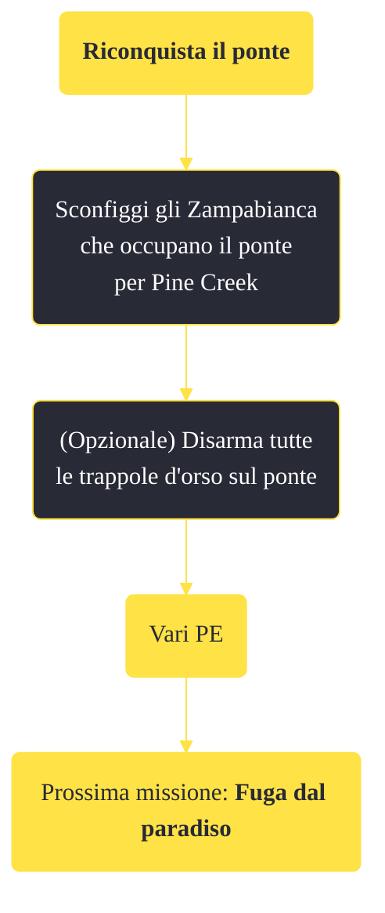

---
# Title, summary, and page position.
linktitle: "Riconquista il ponte"
summary: ""
weight: 10
icon: message-question
icon_pack: fas

# Page metadata.
title: "Riconquista il ponte"
date: 2022-11-15
type: book # Do not modify.
commentable: true
tags: "Missioni di Honest Hearts"
hidden: true # Visibile nella sidebar
private: false # Nascosto dalle ricerche
---

*Riconquista il ponte* è una missione del DLC *Honest Hearts* di Fallout: New Vegas. È data da Joshua Graham.

**Riassunto**:
1. Sconfiggi gli Zampabianca che occupano il ponte per Pine Creek
2. (Opzionale) Disarma tutte le trappole d'orso sul ponte
3. Ricompensa: **vari PE**
4. Prossima missione: *Fuga dal paradiso*

<section class="chart-collapse">
<input type="checkbox" name="collapse2" id="handle2">
<h3 class="handle">
<label for="handle2">Clicca per mostrare il diagramma</label>
</h3>

</section>

| Tappe |       Stato        | Descrizione |
|:-----:|:------------------:| ----------- |
|                           10                          | :white_check_mark: | Sconfiggi gli Zampabianca che occupano il ponte che porta a Pine Creek.                                                                                                     |

**Note**:
- Questa missione viene data simultaneamente con *Fuga da Zion*, *Prigionieri di guerra* e *Santità dei morti*

