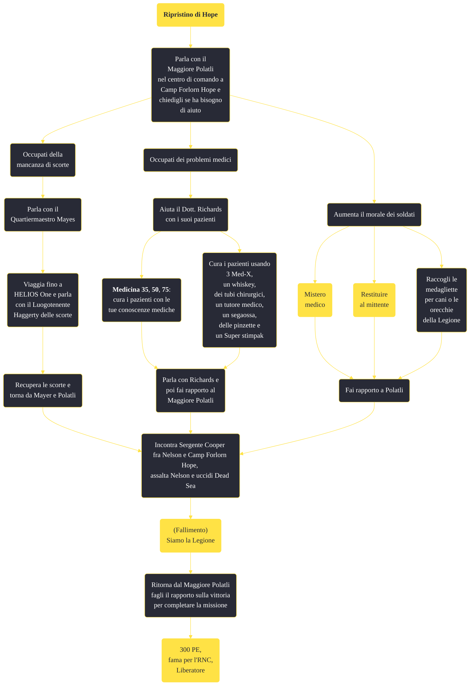

---
# Title, summary, and page position.
linktitle: "Ripristino di Hope"
summary: ""
weight: 10
icon: message-question
icon_pack: fas

# Page metadata.
title: "Ripristino di Hope"
date: 2022-11-15
type: book # Do not modify.
commentable: true
tags: "Missioni secondarie di Fallout: New Vegas"
hidden: true # Visibile nella sidebar
private: false # Nascosto dalle ricerche
---

*Ripristino di Hope* è una missione secondaria di Fallout: New Vegas. È data dal Maggiore Polatli o  Quartiermaestro Mayes a Camp Forlorn Hope.

<section class="chart-collapse">
<input type="checkbox" name="collapse2" id="handle2">
<h3 class="handle">
<label for="handle2">Clicca per mostrare il diagramma</label>
</h3>

</section>

| Tappe |       Stato        | Descrizione |
|:-----:|:------------------:| ----------- |
|                           10                          |            | Parla con il Quartiermastro Mayes.                                                                                                                                          |
|                           40                          |            | Vai all'HELIOS One per investigare sulle scorte di Forlorn Hope.                                                                                                            |
|                           45                          |            | Segui il navigatore GPS fino alle scorte di Forlorn Hope.                                                                                                                   |
|                           50                          |            | Riporta le scorte al Quartiermastro Mayes.                                                                                                                                  |
|                           60                          |            | Parla con il Maggiore Polatli.                                                                                                                                              |
|                           80                          |            | Incontra il Dott. Richards.                                                                                                                                                 |
|                          100                          |            | Aiuta il Dott. Richards con i suoi pazienti.                                                                                                                                |
|                          110                          |            | Torna dal Dott. Richards.                                                                                                                                                   |
|                          150                          |            | Incontra il Sergente Cooper.                                                                                                                                                |
|                          155                          |            | Sconfiggi la Legione a Nelson.                                                                                                                                              |
|                          170                          | :white_check_mark: | Riferisci a Polatli della vittoria a Nelson.                                                                                                                                |

**Sfide abilità**:
- **Medicina 35**: per curare i soldati feriti, usando mezzi di fortuna
- **Medicina 50**: per curare il paziente ferito alla gamba
- **Medicina 75**: per curare il paziente ferito da un'esplosione

**Note**:
- Anche se non esplicitamente segnate, è possibile completare queste missioni per migliorare il morale fra le truppe a Forlorn; il morale può essere espresso con un semplice valore e quando questo valore raggiunge il 10, significa che il morale è alto e le truppe ben motivate:
  - *Mistero medico*: +1 se si smaschera il Soldato semplice Stone o se si costituisce Pip-Boy
  - *Restituire al mittente*: +2 se si dice al Sergente Reyes la verità su Capo Hanlon, +3 se si mantiene il segreto di Hanlon e Reyes si unisce al patto di segretezza
  - *Spirito di squadra*: +1 ogni 10 orecchie della Legione, per un massimo di +3 per 30 orecchie
  - *Tags of Our Fallen* (nascosta): +1 per ogni 5 medagliette per cani consegnata, per un massimo di +3 per 15 medagliette 
- Curando i soldati feriti in infermeria e ottenendo le scorte da HELIOS One si guadagneranno altri 2 punti. Completando al meglio tutte le missioni, il massimo punteggio possibile è 12
- Eliminando la guarnigione a HELIOS One o quella a Nelson di propria iniziativa, è possibile rimanere bloccati nel completamento di questa missione
- Più è alto è il morale, meglio equipaggiate saranno le truppe nell'assalto contro Nelson

