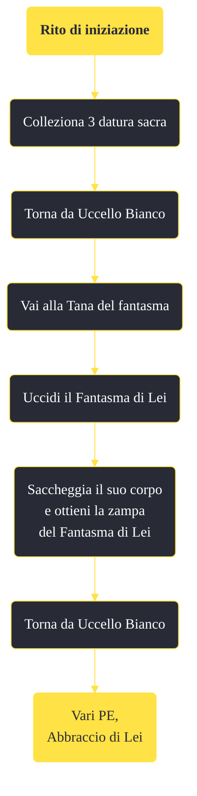

---
# Title, summary, and page position.
linktitle: "Rito di iniziazione"
summary: ""
weight: 10
icon: message-question
icon_pack: fas

# Page metadata.
title: "Rito di iniziazione"
date: 2022-11-15
type: book # Do not modify.
commentable: true
tags: "Missioni di Honest Hearts"
hidden: true # Visibile nella sidebar
private: false # Nascosto dalle ricerche
---

*Rito di iniziazione* è una missione del DLC *Honest Hearts* di Fallout: New Vegas. È data da Uccello Bianco all'accampamento dei Tormenti.

**Riassunto**:
1. Colleziona 3 datura sacra
2. Torna da Uccello Bianco
3. Vai alla Tana del fantasma
4. Uccidi il Fantasma di Lei
5. Saccheggia il suo corpo e ottieni la zampa del Fantasma di Lei
6. Torna da Uccello Bianco
7. Ricompensa: **vari PE**, **Abbraccio di Lei**

<section class="chart-collapse">
<input type="checkbox" name="collapse2" id="handle2">
<h3 class="handle">
<label for="handle2">Clicca per mostrare il diagramma</label>
</h3>

</section>

| Tappe |       Stato        | Descrizione |
|:-----:|:------------------:| ----------- |
|                           5                           |            | Parla con lo sciamano Uccello Bianco.                                                                                                                                       |
|                           10                          |            | Raccogli le radici di 3 piante di Datura sacra.                                                                                                                             |
|                           20                          | :white_check_mark: | Porta le radici allo sciamano.                                                                                                                                              |
|                           25                          |            | Raccogli le radici di 3 piante di Datura sacra.                                                                                                                             |
|                           30                          |            | Torna dallo sciamano per iniziare il rituale.                                                                                                                               |
|                           40                          |            | Recupera la zampa del Fantasma di Lei.                                                                                                                                      |
|                           50                          | :white_check_mark: | Torna dallo sciamano.                                                                                                                                                       |

