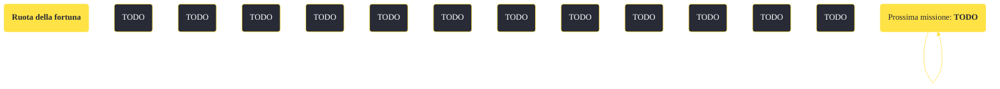

---
# Title, summary, and page position.
linktitle: "Ruota della fortuna"
summary: ""
weight: 10
icon: message-question
icon_pack: fas

# Page metadata.
title: "Ruota della fortuna"
date: 2022-11-15
type: book # Do not modify.
commentable: true
tags: "Missioni secondarie di Fallout: New Vegas"
hidden: true # Visibile nella sidebar
private: false # Nascosto dalle ricerche
---

*Ruota della fortuna* è una missione secondaria di Fallout: New Vegas. È data da Logan a Camp Searchlight.

<section class="chart-collapse">
<input type="checkbox" name="collapse2" id="handle2">
<h3 class="handle">
<label for="handle2">Clicca per mostrare il diagramma</label>
</h3>

</section>

| Tappe |       Stato        | Descrizione |
|:-----:|:------------------:| ----------- |
|                           10                          |            | Parla con qualcuno a Nipton delle tute antiradiazioni scomparse.                                                                                                            |
|                           15                          |            | Trova tute in una caverna vicina.                                                                                                                                           |
|                           20                          |            | Torna con le tute da Logan.                                                                                                                                                 |
|                           30                          |            | Vai a perlustrare la stazione di polizia con Logan.                                                                                                                         |
|                           40                          | :white_check_mark: | Vai a perlustrare la stazione dei pompieri con Logan.                                                                                                                       |

**Sfide abilità**:
- **Scasso 50**: per accedere alla caverna delle scorte

**Note**:
- È possibile completare la missione anche se Logan muore durante il combattimento con la regina degli scorpioni radioattivi
- Le armi e gli oggetti ottenuti non possono essere scartati o utilizzati fintanto che non si finisce la missione
- Se ti sei è già impossessato delle tute antiradiazioni prima di cominciare la missione, è possibile che la missione non possa essere completata o che non compaiano alcuni voci di dialogo 

