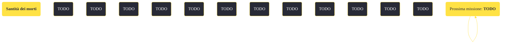

---
# Title, summary, and page position.
linktitle: "Santità dei morti"
summary: ""
weight: 10
icon: message-question
icon_pack: fas

# Page metadata.
title: "Santità dei morti"
date: 2022-11-15
type: book # Do not modify.
commentable: true
tags: "Missioni di Honest Hearts"
hidden: true # Visibile nella sidebar
private: false # Nascosto dalle ricerche
---

*Santità dei morti* è una missione del DLC *Honest Hearts* di Fallout: New Vegas. È data da Joshua Graham.

<section class="chart-collapse">
<input type="checkbox" name="collapse2" id="handle2">
<h3 class="handle">
<label for="handle2">Clicca per mostrare il diagramma</label>
</h3>

</section>

| Tappe |       Stato        | Descrizione |
|:-----:|:------------------:| ----------- |
|                           10                          |            | Opzionale: Parla con i Tormenti al cimitero.                                                                                                                                |
|                           15                          |            | Opzionale: Uccidi gli Zampabianca che stanno profanando il cimitero dei Tormenti.                                                                                           |
|                           20                          | :white_check_mark: | Uccidi gli Zampabianca che stanno profanando il cimitero dei Tormenti.                                                                                                      |

**Sfide abilità**:
- **Eloquenza 75**: per convincere i Tormenti che non hanno alcuna speranza contro gli Zampabianca

**Note**:
- Questa missione viene data simultaneamente con *Fuga da Zion*, *Prigionieri di guerra* e *Riconquista il ponte*

