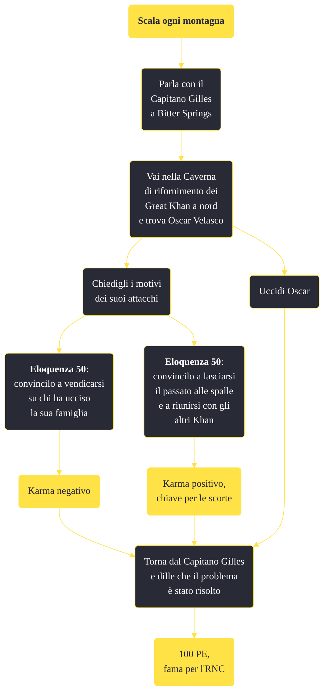

---
# Title, summary, and page position.
linktitle: "Scala ogni montagna"
summary: ""
weight: 10
icon: message-question
icon_pack: fas

# Page metadata.
title: "Scala ogni montagna"
date: 2022-11-15
type: book # Do not modify.
commentable: true
tags: "Missioni secondarie di Fallout: New Vegas"
hidden: true # Visibile nella sidebar
private: false # Nascosto dalle ricerche
---

*Scala ogni montagna* è una missione secondaria di Fallout: New Vegas. È data dal Capitano Gilles a Bitter Springs.

<section class="chart-collapse">
<input type="checkbox" name="collapse2" id="handle2">
<h3 class="handle">
<label for="handle2">Clicca per mostrare il diagramma</label>
</h3>

</section>

| Tappe |       Stato        | Descrizione |
|:-----:|:------------------:| ----------- |
|                           10                          |            | Trova l'origine degli attacchi a Bitter Springs.                                                                                                                            |
|                           20                          | :white_check_mark: | Parla al Capitano Gilles di Oscar Velasco.                                                                                                                                  |

**Sfide abilità**:
- **Eloquenza 50**: per convincere Oscar Velasco a tornare a Red Rock Canyon

**Note**:
- Portando Boone, indossando un'armatura RNC o una della Confraternita d'Acciaio, Oscar diventerà ostile e dovrà per forza essere ucciso 

