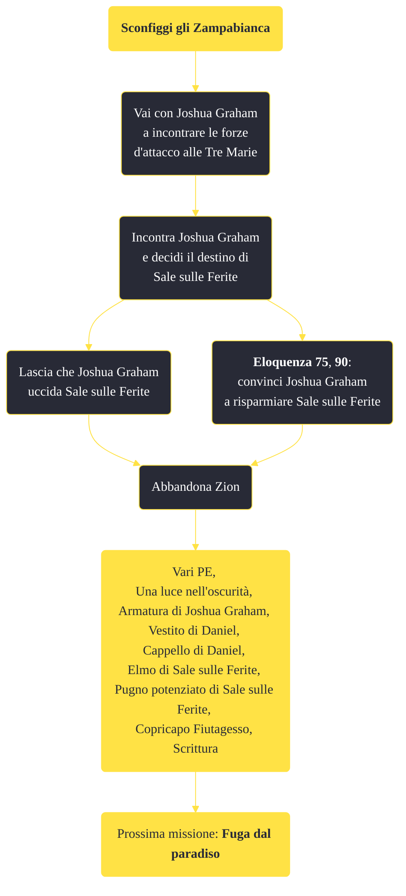

---
# Title, summary, and page position.
linktitle: "Sconfiggi gli Zampabianca"
summary: ""
weight: 10
icon: message-question
icon_pack: fas

# Page metadata.
title: "Sconfiggi gli Zampabianca"
date: 2022-11-15
type: book # Do not modify.
commentable: true
tags: "Missioni di Honest Hearts"
hidden: true # Visibile nella sidebar
private: false # Nascosto dalle ricerche
---

*Sconfiggi gli Zampabianca* è una missione del DLC *Honest Hearts* di Fallout: New Vegas. È data da Joshua Graham.

<section class="chart-collapse">
<input type="checkbox" name="collapse2" id="handle2">
<h3 class="handle">
<label for="handle2">Clicca per mostrare il diagramma</label>
</h3>

</section>

| Tappe |       Stato        | Descrizione |
|:-----:|:------------------:| ----------- |
|                           10                          |            | Trova il capo degli Zampabianca, Sale sulle Ferite, e affrontalo.                                                                                                           |
|                           30                          | :white_check_mark: | Torna da Daniel alle Gole.                                                                                                                                                  |

**Sfide abilità**:
- **Eloquenza 75**, **90**: per convincere Joshua Graham a risparmiare Sale sulle Ferite

**Note**:
- Dopo questa missione, tutti i protagonisti del DLC spariranno, mentre a Zion resteranno solo gli altri personaggi tribali generici
- Non è possibile salvare tutti i Tormenti e tutti i Cavalli Morti, poiché alcune morti sono scriptate
- Uccidere, anche per sbaglio, un qualsiasi membro dei Tormenti o dei Cavalli Morti, renderà ostile Joshua Graham e la missione non potrà essere completata
- Non è possibile usare il viaggio rapido quando questa missione è attiva

