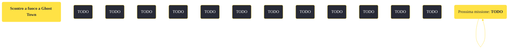

---
# Title, summary, and page position.
linktitle: "Scontro a fuoco a Ghost Town"
summary: ""
weight: 10
icon: message-question
icon_pack: fas

# Page metadata.
title: "Scontro a fuoco a Ghost Town"
date: 2022-11-15
type: book # Do not modify.
commentable: true
tags: "Missioni secondarie di Fallout: New Vegas"
hidden: true # Visibile nella sidebar
private: false # Nascosto dalle ricerche
---

*Scontro a fuoco a Ghost Town* è una missione secondaria di Fallout: New Vegas. È data da Trudy a Goodsprings.

<section class="chart-collapse">
<input type="checkbox" name="collapse2" id="handle2">
<h3 class="handle">
<label for="handle2">Clicca per mostrare il diagramma</label>
</h3>

</section>

| Tappe |       Stato        | Descrizione |
|:-----:|:------------------:| ----------- |
|                           5                           |            | Offri aiuto a Ringo per affrontare i Powder Ganger.                                                                                                                         |
|                           10                          |            | Parla con Sunny Smiles della lotta contro i Powder Ganger.                                                                                                                  |
|                           20                          |            | (Opzionale) Ottieni l'aiuto di Trudy.                                                                                                                                       |
|                           30                          |            | (Opzionale) Convinci Chet a fornire le scorte del suo negozio alla città.                                                                                                   |
|                           40                          |            | (Opzionale) Recupera la dinamite di Easy Pete.                                                                                                                              |
|                           45                          |            | (Opzionale) Recupera forniture mediche aggiuntive dal Dott. Mitchell.                                                                                                       |
|                           50                          |            | Torna da Ringo e riferiscigli che Sunny Smiles ha accettato di aiutarti a combattere contro i Powder Ganger.                                                                |
|                           60                          |            | Torna da Ringo quando sarai pronto ad affrontare lo scontro a fuoco con i Powder Ganger.                                                                                    |
|                           65                          |            | Unisciti a Sunny.                                                                                                                                                           |
|                           70                          | :white_check_mark: | Sconfiggi i Powder Ganger.                                                                                                                                                  |

**Sfide abilità**:
- **Eloquenza 25**/**Furtivo 25**: per pianificare l'imboscata con Trudy
- **Baratto 25**: per convincere Chet a prestare alcune armature di cuoio (senza sborsare 1000 tappi)
- **Esplosivi 25**: per ottenere della dinamite da Easy Pete
- **Medicina 25**: per ottenere delle scorte mediche dal Dott. Mitchell

**Note**:
- Non è possibile iniziare questa missione se è già in corso *Corri Goodsprings, corri*
- Non partecipando attivamente alle uccisioni dei Powder Ganger, guadagnerai una reputazione "mista", rendendo possibile entrare nel Complesso Penitenziario dell'RNC senza venir attaccati
- Se nello scontro si colpisce accidentalmente uno degli abitanti di Goodsprings, l'intera cittadina diventerà ostile 

