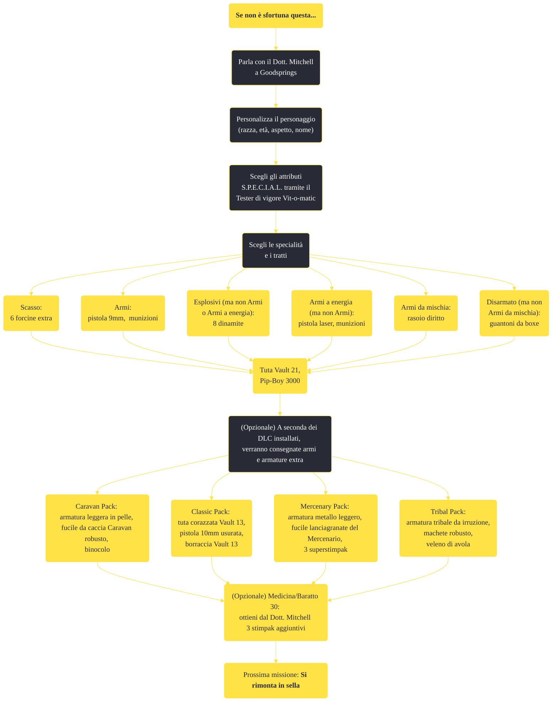

---
# Title, summary, and page position.
linktitle: "Se non è sfortuna questa..."
summary: ""
weight: 10
icon: message-question
icon_pack: fas

# Page metadata.
title: "Se non è sfortuna questa..."
date: 2022-11-15
type: book # Do not modify.
commentable: true
tags: "Missioni principali di Fallout: New Vegas"
hidden: true # Visibile nella sidebar
private: false # Nascosto dalle ricerche
---

*Se non è sfortuna questa...* è una missione principale di Fallout: New Vegas. È data dal Dott. Mitchell a Goodsprings.

**Riassunto**:
1. Parla con il Dott. Mitchell a Goodsprings
2. Personalizza il personaggio (razza, età, aspetto, nome)
3. Scegli gli attributi S.P.E.C.I.A.L. tramite il Tester di vigore Vit-o-matic
4. Scegli le specialità e i tratti
   - Scasso: 6 forcine extra
   - Armi: pistola 9mm, munizioni
   - Esplosivi (ma non Armi o Armi a energia): 8 dinamite
   - Armi a energia (ma non Armi): **Pistola laser**, munizioni
   - Armi da mischia: **Rasoio diritto**
   - Disarmato (ma non Armi da mischia): **Guantoni da boxe**
5. Ricompensa: **Tuta Vault 21**, **Pip-Boy 3000**
6. (Opzionale) A seconda dei DLC installati, verranno consegnate armi e armature extra
   - Caravan Pack: armatura leggera in pelle, fucile da caccia Caravan robusto, binocolo
   - Classic Pack: tuta corazzata Vault 13, pistola 10mm usurata, borraccia Vault 13
   - Mercenary Pack: armatura metallo leggero, fucile lanciagranate del Mercenario, 3 superstimpak
   - Tribal Pack: armatura tribale da irruzione, machete robusto, veleno di avola
5. (Opzionale) **Medicina**/**Baratto 30**: ottieni dal Dott. Mitchell 3 stimpak aggiuntivi
7. Prossima missione: *Si rimonta in sella*

<section class="chart-collapse">
<input type="checkbox" name="collapse2" id="handle2">
<h3 class="handle">
<label for="handle2">Clicca per mostrare il diagramma</label>
</h3>

</section>

| Tappe |       Stato        | Descrizione                                             |
|:-----:|:------------------:| ------------------------------------------------------- |
|  10   |                    | Vai al tester della forza Vit-o-matic.                  |
|  30   |                    | Usa il tester della forza Vit-o-matic.                  |
|  40   |                    | Accomodati sul divano del soggiorno del Dott. Mitchell. |
|  50   | :white_check_mark: | Segui il Dott. Mitchell fino all'uscita.                |

**Sfide abilità**:
- **Medicina**/**Baratto 30**: dopo il dialogo finale con il Dott. Mitchell è possibile ottenere 3 stimpak aggiuntivi

**Note**:
- Le ricompense cambiano in base alle Specialità scelte:  
	- 6 forcine (per un totale di 12) se si sceglie **Scasso**
	- Pistola 9mm e 43 colpi se si sceglie **Armi**
	- 8 candelotti di dinamite se si sceglie **Esplosivi** (ma non si sceglie né **Armi** né **Armi a energia**)  
	- Pistola laser e 20 celle a energia se si sceglie **Armi a energia** (ma non si sceglie **Armi**)  
	- Rasoio diritto se si sceglie **Armi da mischia**
	- Guantoni da boxe se si sceglie **Disarmato** (ma non si sceglie **Armi da mischia**)

