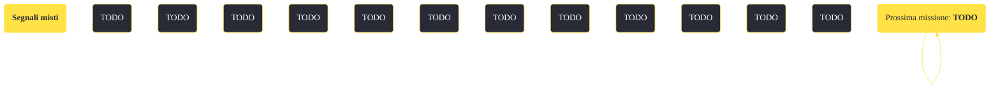

---
# Title, summary, and page position.
linktitle: "Segnali misti"
summary: ""
weight: 10
icon: message-question
icon_pack: fas

# Page metadata.
title: "Segnali misti"
date: 2022-11-15
type: book # Do not modify.
commentable: true
tags: "Missioni di Dead Money"
hidden: true # Visibile nella sidebar
private: false # Nascosto dalle ricerche
---

*Segnali misti* è una missione del DLC *Dead Money* di Fallout:New Vegas. È data da Padre Elijah alla stazione smistamento Puesta del Sol.

<section class="chart-collapse">
<input type="checkbox" name="collapse2" id="handle2">
<h3 class="handle">
<label for="handle2">Clicca per mostrare il diagramma</label>
</h3>

</section>

| Tappe |       Stato        | Descrizione |
|:-----:|:------------------:| ----------- |
|                           10                          |            | Vai alla Stazione di smistamento di Puesta del Sol con Christine.                                                                                                           |
|                           20                          |            | Ripara la scatola elettrica per accedere alla Stazione di smistamento.                                                                                                      |
|                           30                          |            | Porta Christine all'ascensore della Sala di controllo manuale.                                                                                                              |
|                           40                          |            | Chiedi a Christine di prendere l'ascensore fino alla Sala di controllo manuale.                                                                                             |
|                           50                          |            | Accedi al Terminale di manutenzione remoto per conto di Christine.                                                                                                          |
|                           60                          |            | Usa i comandi dell'ascensore per far scendere Christine fino alla Sala di controllo manuale.                                                                                |
|                           70                          | :white_check_mark: | Porta Christine al Terminale di manutenzione remoto e falle sapere che può essere usato.                                                                                    |

