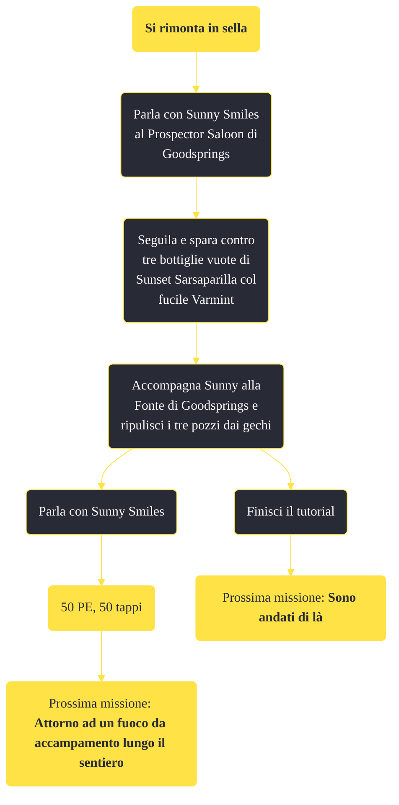

---
# Title, summary, and page position.
linktitle: Si rimonta in sella
summary: ""
weight: 10
icon: message-question
icon_pack: fas

# Page metadata.
title: Si rimonta in sella
date: 2022-11-15
type: book # Do not modify.
commentable: true
tags: "Missioni principali di Fallout: New Vegas"
hidden: true # Visibile nella sidebar
private: false # Nascosto dalle ricerche
---

*Si rimonta in sella* è una missione principale di Fallout: New Vegas. È data da Sunny Smiles a Goodsprings.

<section class="chart-collapse">
<input type="checkbox" name="collapse2" id="handle2">
<h3 class="handle">
<label for="handle2">Clicca per mostrare il diagramma</label>
</h3>

</section>

| Tappe |       Stato        | Descrizione                                                   |
|:-----:|:------------------:| ------------------------------------------------------------- |
|   3   |                    | Parla con Sunny Smiles al Prospector Saloon.                  |
|   4   |                    | Incontra Sunny Smiles sul retro del Prospector Saloon.        |
|  10   | :white_check_mark: | Spara a 3 bottiglie Sarsaparilla fuori dal Prospector Saloon. |
|  20   |                    | Segui Sunny.                                                  |
|  30   |                    | Uccidi i gechi al pozzo.                                      |
|  40   | :white_check_mark: | Parla con Sunny Smiles.                                       |
|  50   |                    | Uccidi i gechi in altri pozzi.                                |
|  60   | :white_check_mark: | Parla a Sunny della tua ricompensa.                           |
|  70   |                    | Vai a trovare Trudy al Prospector Saloon.                     |

**Note**:
- La fama per Goodsprings si guadagna se si riesce a salvare il colono prima che i gechi lo uccidano
 

