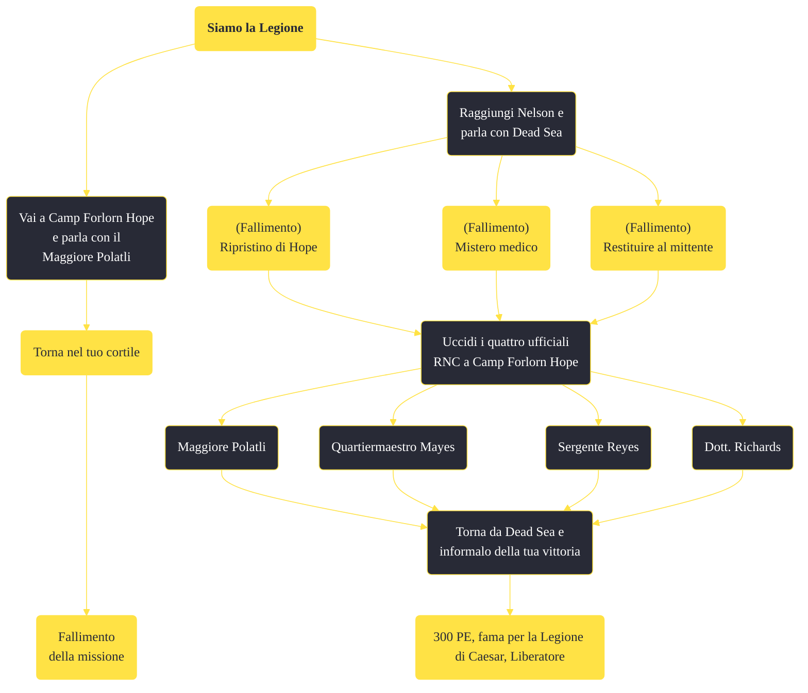

---
# Title, summary, and page position.
linktitle: "Siamo la Legione"
summary: ""
weight: 10
icon: message-question
icon_pack: fas

# Page metadata.
title: "Siamo la Legione"
date: 2022-11-15
type: book # Do not modify.
commentable: true
tags: "Missioni secondarie di Fallout: New Vegas"
hidden: true # Visibile nella sidebar
private: false # Nascosto dalle ricerche
---

*Siamo la Legione* è una missione secondaria di Fallout: New Vegas. È data da Dead Sea a Nelson.

<section class="chart-collapse">
<input type="checkbox" name="collapse2" id="handle2">
<h3 class="handle">
<label for="handle2">Clicca per mostrare il diagramma</label>
</h3>

</section>

| Tappe |       Stato        | Descrizione |
|:-----:|:------------------:| ----------- |
|                           10                          |            | Uccidi gli Ufficiali dell'RNC a Camp Forlorn Hope                                                                                                                           |
|                           20                          | :white_check_mark: | Torna da Dead Sea e informalo della tua vittoria                                                                                                                            |

**Note**:
- Molti di questi ufficiali sono coinvolti nella missione *Ripristino di Hope* che, completandola, fallirà questa missione; tutte le altre missioni che coinvolgono membri dell'accampamento vanno terminate prima
- I soldati all'accampamento hanno un livello che scala con quello del giocatore: maggiore è il livello del Corriere, più forti sono i soldati, rendendoli temibili 
- Se si ha completato *Taglia tre carte*, nell'accampamento sarà presente anche il 1° Ricognitori
- Se si completa precedentemente *Torna nel tuo cortile*, Dead Sea sarà ostile e questa missione non sarà ottenibile
- Anche se il Corriere ha eliminato tutti i soldati RNC, essi continueranno a rigenerarsi e l'accampamento non sarà mai occupato dai legionari

