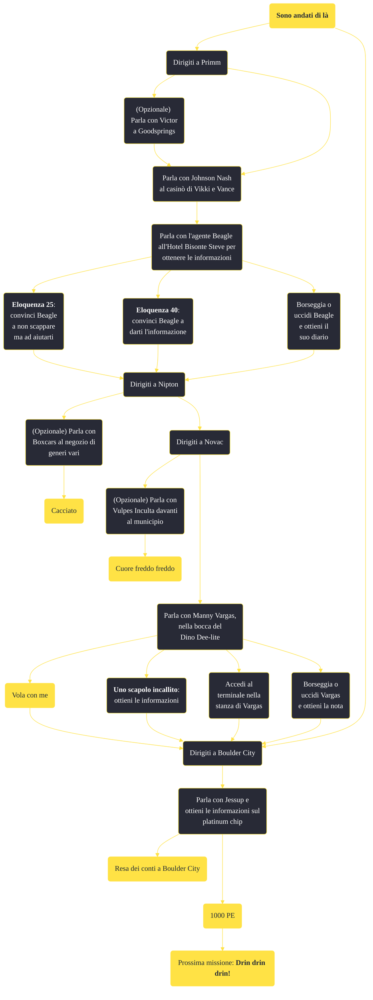

---
# Title, summary, and page position.
linktitle: Sono andati di là
summary: ""
weight: 10
icon: message-question
icon_pack: fas

# Page metadata.
title: Sono andati di là
date: 2022-11-15
type: book # Do not modify.
commentable: true
tags: "Missioni principali di Fallout: New Vegas"
hidden: true # Visibile nella sidebar
private: false # Nascosto dalle ricerche
---

*Sono andati di là* è una missione principale di Fallout: New Vegas. È data da Dott. Mitchell a Goodsprings.

<section class="chart-collapse">
<input type="checkbox" name="collapse2" id="handle2">
<h3 class="handle">
<label for="handle2">Clicca per mostrare il diagramma</label>
</h3>

</section>

| Tappe |       Stato        | Descrizione                                                                                                  |
| :---: | :----------------: | ------------------------------------------------------------------------------------------------------------ |
|  10   |                    | Trova gli uomini che hanno cercato di ucciderti.                                                             |
|  20   |                    | (Opzionale) Chiedi in giro nel saloon di Goodsprings per raccogliere informazioni sui tuoi assalitori.       |
|  25   |                    | (Opzionale) Parla con Victor a Goodsprings del tuo salvataggio.                                              |
|  30   |                    | Chiedi informazioni sul tuo incarico di spedizione all'amministratore di Mojave Express a Primm.             |
|  34   |                    | Trova il rappresentate della legge di Primm per sapere dove sono andati i tuoi assalitori.                   |
|  36   |                    | Recupera il diario di Beagle dal suo cadavere per raccogliere informazioni sui tuoi assalitori.              |
|  38   |                    | Ascolta il diario di Beagle per raccogliere informazioni sul luogo in cui si trovano i tuoi assalitori.      |
|  40   |                    | Dirigiti a Novac passando per Nipton. Giunto a Novac, cerca di raccogliere informazioni sui tuoi assalitori. |
|  45   |                    | Scopri da Manny Vargas dove erano diretti i Khan.                                                            |
|  46   |                    | Perquisisci il corpo di Manny alla ricerca di indizi sul luogo in cui potrebbero trovarsi i tuoi assalitori. |
|  50   |                    | Intercetta i Great Khan a Boulder City.                                                                      |
|  60   | :white_check_mark: | Scopri dove si trova attualmente il Platinum Chip.                                                           |

**Sfide abilità**:
- **Eloquenza 25**: per convincere Beagle a non scappare ma ad aiutarci
- **Eloquenza 40**: per convincere Beagle a darci l'informazione

**Note**:
- La missione si può concludere in qualsiasi momento, entrando semplicemente nel casinò The Tops e trovando Benny
- Completando questa missione, non apparirà più il dialogo di Trudy per riparare la radio al Prospector's Saloon di Goodsprings

