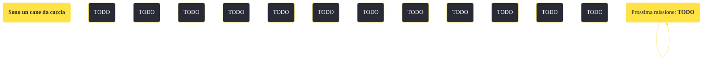

---
# Title, summary, and page position.
linktitle: "Sono un cane da caccia"
summary: ""
weight: 10
icon: message-question
icon_pack: fas

# Page metadata.
title: "Sono un cane da caccia"
date: 2022-11-15
type: book # Do not modify.
commentable: true
tags: "Missioni secondarie di Fallout: New Vegas"
hidden: true # Visibile nella sidebar
private: false # Nascosto dalle ricerche
---

*Sono un cane da caccia* è una missione secondaria di Fallout: New Vegas. È data dal Re alla King's School of Impersonation.

<section class="chart-collapse">
<input type="checkbox" name="collapse2" id="handle2">
<h3 class="handle">
<label for="handle2">Clicca per mostrare il diagramma</label>
</h3>

</section>

| Tappe |       Stato        | Descrizione |
|:-----:|:------------------:| ----------- |
|                           1                           |            | Parla con Julie Farkas su cosa fare per aiutare Rex.                                                                                                                        |
|                           2                           |            | Torna dal Re per informarlo che Rex può essere curato.                                                                                                                      |
|                           10                          |            | Porta Rex dal Dottor Henry a Jacobstown per scoprire come ripararlo.                                                                                                        |
|                           20                          |            | Recupera un nuovo cervello per Rex da uno dei cani della Signora Gibson.                                                                                                    |
|                           25                          |            | (Opzionale) Cerca un cervello canino eccezionale nella Legione di Caesar.                                                                                                   |
|                           30                          |            | (Opzionale) Cerca un cervello canino eccezionale tra i Demoni.                                                                                                              |
|                           50                          | :white_check_mark: | Torna a Jacobstown e fai trapiantare il cervello a Rex.                                                                                                                     |

**Sfide abilità**:
- **Baratto 70**: per ottenere gratuitamente il cervello di Rey dall'Anziana signora Gibson

**Note**:
- Anche se si hai già completato *Valzer delle candele*, il Dottor Henry comparirà sempre a Jacobstown
- Se si decide di impiantare il cervello di Lupa in Rex, Boone si rifiuterà di accompagnarti fintanto che Rex è un tuo seguace 

