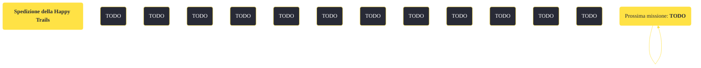

---
# Title, summary, and page position.
linktitle: "Spedizione della Happy Trails"
summary: ""
weight: 10
icon: message-question
icon_pack: fas

# Page metadata.
title: "Spedizione della Happy Trails"
date: 2022-11-15
type: book # Do not modify.
commentable: true
tags: "Missioni di Honest Hearts"
hidden: true # Visibile nella sidebar
private: false # Nascosto dalle ricerche
---

*Spedizione della Happy Trails* è una missione del DLC *Honest Hearts* di Fallout: New Vegas. È data dalla trasmissione della Happy Trails Caravan Company al passaggio settentrionale.

<section class="chart-collapse">
<input type="checkbox" name="collapse2" id="handle2">
<h3 class="handle">
<label for="handle2">Clicca per mostrare il diagramma</label>
</h3>

</section>

| Tappe |       Stato        | Descrizione |
|:-----:|:------------------:| ----------- |
|                           10                          |            | Trova il capo della carovana Happy Trails.                                                                                                                                  |
|                           20                          |            | Fa' sapere a Jed che sei pronto a partire quando sarai da solo e con non più di 75 libbre di carico.                                                                        |
|                           30                          |            | Fa' sapere a Jed che sei pronto a partire quando sarai da solo e con non più di 100 libbre di carico.                                                                       |
|                          100                          | :white_check_mark: | Missione completata                                                                                                                                                         |

**Sfide abilità**:
- **Sopravvivenza 50**/**Schiena resistente**/**Ladruncolo**: per aumentare il peso trasportabile massimo a 100 libbre
- **Medicina 45**: per diagnosticare la dipendenza da droghe di Ricky
- **Sopravvivenza ???**/**Armi ???**/**Scienza ???**: per sburgiardare Ricky

**Note**:
- Per poter proseguire dovrai alleggerire il tuo inventario e raggiungere un massimo di 75 libbre di peso trasportabile

