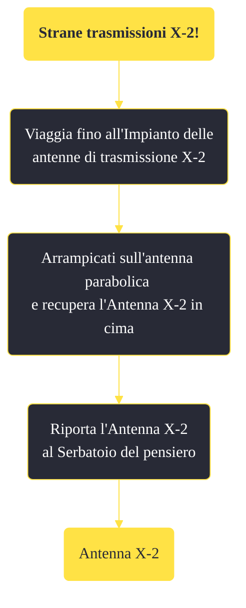

---
# Title, summary, and page position.
linktitle: "Strane trasmissioni X-2!" 
summary: ""
weight: 10
icon: message-question
icon_pack: fas

# Page metadata.
title: "Strane trasmissioni X-2!"
date: 2022-11-15
type: book # Do not modify.
commentable: true
tags: "Missioni di Old World Blues"
hidden: true # Visibile nella sidebar
private: false # Nascosto dalle ricerche
---

*Strane trasmissioni X-2!* è una missione del DLC *Old World Blues* di Fallout: New Vegas. È data dal dottor Klein al Serbatoio del pensiero.

**Riassunto**:
1. Viaggia fino all'Impianto delle antenne di trasmissione X-2
2. Arrampicati sull'antenna parabolica e recupera l'Antenna X-2 in cima
3. Riporta l'Antenna X-2 al Serbatoio del pensiero
4. Ricompensa: **Antenna X-2**

<section class="chart-collapse">
<input type="checkbox" name="collapse2" id="handle2">
<h3 class="handle">
<label for="handle2">Clicca per mostrare il diagramma</label>
</h3>

</section>

| Tappe |       Stato        | Descrizione |
|:-----:|:------------------:| ----------- |
|                           10                          |            | Vai all'Impianto delle antenne di trasmissione X-2.                                                                                                                         |
|                           20                          | :white_check_mark: | Raggiungi l'antenna parabolica e recupera l'antenna X-2.                                                                                                                    |

**Note**:
- L'Antenna X-2 recuperata in questa missione è l'unica utilizzabile come arma

