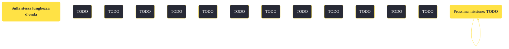

---
# Title, summary, and page position.
linktitle: "Sulla stessa lunghezza d'onda" 
summary: ""
weight: 10
icon: message-question
icon_pack: fas

# Page metadata.
title: "Sulla stessa lunghezza d'onda"
date: 2022-11-15
type: book # Do not modify.
commentable: true
tags: "Missioni di Old World Blues"
hidden: true # Visibile nella sidebar
private: false # Nascosto dalle ricerche
---

*Sulla stessa lunghezza d'onda* è una missione del DLC *Old World Blues* di Fallout: New Vegas. È data dal dottor 8 al Serbatoio del pensiero.

<section class="chart-collapse">
<input type="checkbox" name="collapse2" id="handle2">
<h3 class="handle">
<label for="handle2">Clicca per mostrare il diagramma</label>
</h3>

</section>

| Tappe |       Stato        | Descrizione |
|:-----:|:------------------:| ----------- |
|                           10                          | :white_check_mark: | Indaga sul codice termlink di 8.                                                                                                                                            |

**Sfide abilità**:
- **Scienza 75**/**Percezione 7**: per violare il modulo vocale del Dottor 8

**Note**:
- Questa è una delle missioni che se completata può aiutare a terminare il DLC in maniera pacifica

