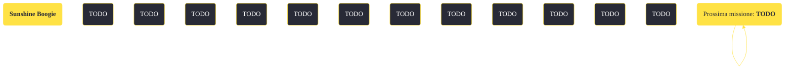

---
# Title, summary, and page position.
linktitle: "Sunshine Boogie"
summary: ""
weight: 10
icon: message-question
icon_pack: fas

# Page metadata.
title: "Sunshine Boogie"
date: 2022-11-15
type: book # Do not modify.
commentable: true
tags: "Missioni secondarie di Fallout: New Vegas"
hidden: true # Visibile nella sidebar
private: false # Nascosto dalle ricerche
---

*Sunshine Boogie* è una missione secondaria di Fallout: New Vegas. È data da Loyal all'impianto della base aeronautica di Nellis.

<section class="chart-collapse">
<input type="checkbox" name="collapse2" id="handle2">
<h3 class="handle">
<label for="handle2">Clicca per mostrare il diagramma</label>
</h3>

</section>

| Tappe |       Stato        | Descrizione |
|:-----:|:------------------:| ----------- |
|                           25                          |            | Trova i pezzi di ricambio dell'impianto fotovoltaico.                                                                                                                       |
|                           50                          |            | Ripara i pannelli rotti dell'impianto fotovoltaico.                                                                                                                         |
|                           75                          |            | [Opzionale] Migliora l'efficienza dell'impianto fotovoltaico.                                                                                                               |
|                          100                          | :white_check_mark: | Comunica a Loyal che l'impianto fotovoltaico è stato riparato.                                                                                                              |

**Sfide abilità**:
- **Riparazione 20**: per riparare i pannelli fotovoltaici con i pezzi di ricambio presi a HELIOS One
- **Riparazione 65**: per riparare i pannelli fotovoltaici senza pezzi di ricambio
- **Scienza 50**: per aumentare l'efficienza dell'impianto

