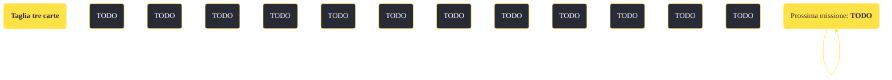

---
# Title, summary, and page position.
linktitle: "Taglia tre carte"
summary: ""
weight: 10
icon: message-question
icon_pack: fas

# Page metadata.
title: "Taglia tre carte"
date: 2022-11-15
type: book # Do not modify.
commentable: true
tags: "Missioni secondarie di Fallout: New Vegas"
hidden: true # Visibile nella sidebar
private: false # Nascosto dalle ricerche
---

*Taglia tre carte* è una missione secondaria di Fallout: New Vegas. È data dal Maggiore Dhatri a Camp McCarran.

<section class="chart-collapse">
<input type="checkbox" name="collapse2" id="handle2">
<h3 class="handle">
<label for="handle2">Clicca per mostrare il diagramma</label>
</h3>

</section>

| Tappe |       Stato        | Descrizione |
|:-----:|:------------------:| ----------- |
|                           5                           |            | Il Maggiore Dhatri ha messo delle taglie su alcune teste. Parlagli per ricevere una missione o conoscere le taglie.                                                         |
|                           10                          |            | Uccidi Violet e recupera la sua testa, preferibilmente intatta.                                                                                                             |
|                           20                          |            | Uccidi Cook-Cook e recupera la sua testa, preferibilmente intatta.                                                                                                          |
|                           21                          |            | (Opzionale) Uccidi il bramino preferito di Cook-Cook, Queenie, per farlo imbestialire spingendolo ad attaccare amici e nemici.                                              |
|                           22                          |            | (Opzionale) Parla con Little Buster di Cook-Cook.                                                                                                                           |
|                           30                          |            | Uccidi l'Autista Nephi e recupera la sua testa, preferibilmente intatta.                                                                                                    |
|                           31                          |            | (Opzionale) Serviti dell'aiuto del Luogotenente Gorobets e dei suoi cecchini del 1° Ricognitori per far fuori Driver Nephi.                                                 |
|                           40                          | :white_check_mark: | Torna dal Maggiore Dhatri con la testa di Violet e incassa la taglia.                                                                                                       |
|                           50                          | :white_check_mark: | Torna dal Maggiore Dhatri con la testa di Cook-Cook e incassa la taglia.                                                                                                    |
|                           60                          | :white_check_mark: | Torna dal Maggiore Dhatri con la testa dell'Autista Nephi e incassa la taglia.                                                                                              |

 

**Note**:
- Le uccisioni possono essere eseguite in qualsiasi ordine, senza influenzare l'esito della missione
- Completando questa missione, il 1° Ricognitori si sposterà a Camp Forlorn Hope e renderà impossibile completare la missione personale (nascosta) *Old School Ghoul* per Raul, poiché il Caporale Sterling non avrà più l'opzione di dialogo per farla proseguire 

