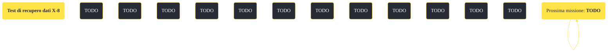

---
# Title, summary, and page position.
linktitle: "Test di recupero dati X-8" 
summary: ""
weight: 10
icon: message-question
icon_pack: fas

# Page metadata.
title: "Test di recupero dati X-8"
date: 2022-11-15
type: book # Do not modify.
commentable: true
tags: "Missioni di Old World Blues"
hidden: true # Visibile nella sidebar
private: false # Nascosto dalle ricerche
---

*Test di recupero dati X-8* è una missione del DLC *Old World Blues* di Fallout: New Vegas. È data dal terminale del test al centro di ricerca X-8.

<section class="chart-collapse">
<input type="checkbox" name="collapse2" id="handle2">
<h3 class="handle">
<label for="handle2">Clicca per mostrare il diagramma</label>
</h3>

</section>

| Tappe |       Stato        | Descrizione |
|:-----:|:------------------:| ----------- |
|                           10                          |            | Recupera i registri dei tre studenti.                                                                                                                                       |
|                           20                          |            | Esci dall'area di test.                                                                                                                                                     |
|                           25                          |            | Attiva il test istituzionale di recupero dati (avanzato) al terminale di test X-8.                                                                                          |
|                           28                          |            | Entra nell'area di test.                                                                                                                                                    |
|                           30                          |            | Scarica le onde a impulsi EM per la disgregazione del campo per l'emettitore sonoro.                                                                                        |
|                           40                          |            | Recupera i registri dei tre studenti dai terminali da scrivania nella Struttura istituzionale X-8.                                                                          |
|                           50                          |            | Esci dall'area di test.                                                                                                                                                     |
|                           52                          |            | Trova più informazioni sul test dell'X-8.                                                                                                                                   |
|                           55                          |            | Trova la chiave della recinzione dell'X-8 (potenziamento Onde a impulsi EM per emettitore sonoro richiesto).                                                                |
|                           60                          |            | Libera lo strano campione nell'area di test.                                                                                                                                |
|                           70                          |            | Attiva il test istituzionale di recupero dati (base) al terminale di test X-8.                                                                                              |
|                           75                          |            | Entra nell'area di test.                                                                                                                                                    |
|                           80                          |            | Recupera i registri dei tre studenti dai terminali da scrivania nella Struttura istituzionale X-8.                                                                          |
|                           90                          |            | Esci dall'area di test.                                                                                                                                                     |
|                          100                          |            | Attiva il test istituzionale di recupero dati (avanzato) al terminale di test X-8.                                                                                          |
|                          105                          |            | Entra nell'area di test.                                                                                                                                                    |
|                          110                          |            | Recupera i registri dei tre studenti dai terminali da scrivania nella Struttura istituzionale X-8.                                                                          |
|                          120                          |            | Esci dall'area di test.                                                                                                                                                     |
|                          140                          |            | Recupera i registri dei tre studenti dai terminali da scrivania nella Struttura istituzionale X-8.                                                                          |
|                          150                          |            | Esci dall'area di test.                                                                                                                                                     |
|                          160                          | :white_check_mark: | Recupera i dati di test dal terminale di test X-8.                                                                                                                          |

**Note**:
- Vicino al terminale oltre la recinzione è possibile trovare gli **Schemi - FIDO K9000**

